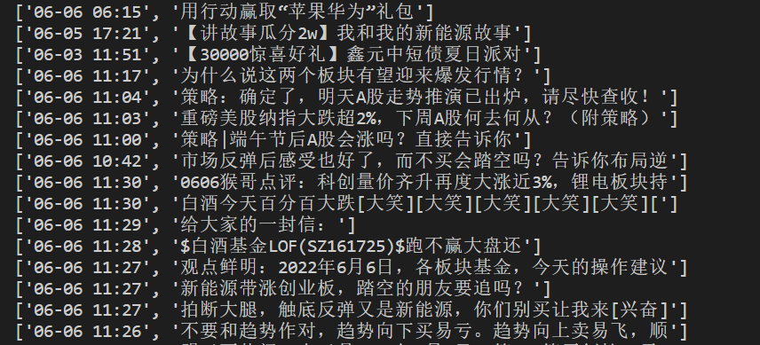

# Python 程序设计实验报告

PB20111686 黄瑞轩

## Level 1

### Level 1.7【统计】时序统计

COVID-19 是由 SARS-CoV-2 导致的传染性疾病，常见症状包括发烧，咳嗽和呼吸急促。现有[全球病情统计结果](https://github.com/CSSEGISandData/COVID-19/tree/master/csse_covid_19_data/csse_covid_19_daily_reports)，以数据 `04-01-2022.csv` 为例，编写一个程序，输出确诊人数（Confirmed​）最多的 10 个国家详细数据（国家 Country/Region，最新更新时间 Last Update，确认病例 Confirmed，死亡病例 Deaths，恢复病例 Recovered）

**思路**：阅读 csv 每一行，提取需要输出的数据栏，列表排序，写入 csv 文件。

**注意**：

- 阅读时同名国家需要合并数据；
- csv写入时，有一个默认的newline参数，如果需要像普通的表格那样，需要设置 `newline=""`。

**初始文件**：


**获得文件**：


## Level 2

### Level 2.13【计算机】

基于 Python，使用浏览器引擎 Selenium 爬取科大首页中的科大要闻第一条新闻，要求爬取结果至少有新闻标题、时间、以及新闻内容。

**思路**：Selenium 使用 Chrome 来做（chromedriver），通过 Selenium 的 `find_element_by_xpath` 方法找到对应的内容。

关键代码：

```python
browser = webdriver.Chrome()
news = []

browser.get("http://ustc.edu.cn/")
browser.find_element_by_xpath("/html/body/main/div[1]/section[1]/ul/li[1]/div[2]/h4[1]/a").click()
news.append(browser.find_element_by_xpath("/html/body/main/div/div/div[1]/form/div[1]").text)
news.append(browser.find_element_by_xpath("/html/body/main/div/div/div[1]/form/div[2]").text)
news.append(browser.find_element_by_xpath('//*[@id="vsb_content_2"]/div').text)
```

爬取结果：


存在 `news` 列表中，`news[0]` 为时间，`news[1]` 为标题，`news[2]` 为内容。

## Level 3

### Level 3.6【物理】

接【数学】Level 2.3 野外彩弹 CS 游戏，考虑重力和空气阻力影响，给定发射点坐标 $(x0,y0,z0)$，落点坐标 $(x1,y1,z1)$，空气阻力 $f$（矢量，以 $(fx,fy,fz)$ 表示），及彩弹的初速度大小 $v0$（标量数值），使用 numpy、math 库等工具求解满足给定起点、落点、空气阻力和初速的发射仰角。

> 提示 1：默认 $g=9.8$ 为常数；如果初速度过小，解可能不存在
>
> 提示 2：弹道计算机的雏形

**思路**：问题的关键是是否**上抛**。从上抛到下落的过程会导致加速度变化，是这个问题的主要难点。在竖直方向，向上运动的加速度为 $g+fz/m$（向下），向下运动的加速度为 $g-fz/m$（定向向下），须知空气阻力**不是动力**。其不可能导致原本向下运动的物体向上运动，所以可以认为向下运动的物体受到的 $z$ 方向加速度仍然是向下的。


这里列出 5 种可能的情况，我们发现情况 1 和 5 是比较特殊的，情况 2 ~ 4 都是上抛再降落的情况，特判讨论即可。

------

**（1）到达最高点前就命中目标**

在竖直方向，有 $z1-z0=vzt-\frac12(g+fz/m)t^2$

解之，得 $t=\frac{vz-\sqrt{vz^2-2(g+fz/m)(z1-z0)}}{g+fz/m}$

此时，对于 $x,y$ 方向，约束条件：$x1-x0=vxt-\frac12(fx/m)t^2，y1-y0=vyt-\frac12(fy/m)t^2$

为了操作方便，将 $t$ 作为一个辅助函数：

```python
def t(vz, fz, z1, z0):
    return ...
```

于是约束函数为：

$L=\left[vxt-\frac12(fx/m)t^2-(x1-x0)\right]^2+\left[vyt-\frac12(fy/m)t^2-(y1-y0)\right]^2+[\sqrt{vx^2+vy^2+vz^2}-v0]^2$

这里需要捕捉的异常为：$t$ 是否是负数

**（5）不向上抛，只有下落状态**

在竖直方向，有 $z1-z0=vzt-\frac12(g-fz/m)t^2$

解之，得 $t=\frac{vz-\sqrt{vz^2-2(g-fz/m)(z1-z0)}}{g-fz/m}$

此时，对于 $x,y$ 方向，约束条件：$x1-x0=vxt-\frac12(fx/m)t^2，y1-y0=vyt-\frac12(fy/m)t^2$

于是约束函数为：

$L=\left[vxt-\frac12(fx/m)t^2-(x1-x0)\right]^2+\left[vyt-\frac12(fy/m)t^2-(y1-y0)\right]^2+[\sqrt{vx^2+vy^2+vz^2}-v0]^2$

合适的话有解，无解的情况比较复杂，不做讨论了。

**（2 ~ 4）诸情况**

上抛过程：$t1=vz/(g+fz/m)$，高度 $h=vz^2/2(g+fz/m)$

此时需要判断是否是情况（3）。

下落过程：$z0+h-z1=\frac12(g-fz/m)t2^2$，可以求出 $t2=\sqrt{2(z0-z1+h)/(g-fz/m)}$。

此时，对于 $x,y$ 方向，约束条件：$x1-x0=vxt-\frac12(fx/m)t^2，y1-y0=vyt-\frac12(fy/m)t^2$

于是约束函数为：

$L=\left[vxt-\frac12(fx/m)t^2-(x1-x0)\right]^2+\left[vyt-\frac12(fy/m)t^2-(y1-y0)\right]^2+[\sqrt{vx^2+vy^2+vz^2}-v0]^2$

这里 $t=t1+t2$，合适的话有解，无解的情况比较复杂，不做讨论了。

------

如果经过以上三种情况判断后都没有解，程序就判断没有解。

按照计算出的 $(vx,vy,vz)$ 来做时序模拟，所得结果如下所示。黄色点是初始位置，蓝色点是末了位置。

> 这里时序模拟用到了 mathplotlib 和 numpy 库。


## Level 4

### Transformers

Transformers 提供了数千种预训练模型来执行文本相关任务，如分类、信息提取、问答、摘要、翻译、文本生成等。github 中提供了相应的api，可以在给定文本上快速下载和使用这些预训练模型，在自己的数据集上对它们进行微调。

#### 情感分析

关键代码如下：

```python
from transformers import pipeline
import csv

c = pipeline('sentiment-analysis')
# 股票明天下跌
print(c("Stocks will fall tomorrow."))
# 明天肯定又会出太阳
print(c("It's bound to be sunny again tomorrow."))
# 日复一日做一样的事情想到明天还要重复做肯定很崩溃
print(c("every single day It must be overwelming to think tomorrow I have to do it over again."))
```

测试结果：


测试结果基本符合事实。

### 有道翻译API（request 库）

向有道翻译的 API 发起 request 请求，实现汉译英效果，就像在 GUI 页面进行翻译业务那样。

**输入**：


**输出**：


### Selenium

这个库的使用已经在 Level 2 中试过，这里不再赘述。

## Level 5

### 基金吧舆论情感走势与基金净值走势的相关检验

**背景**：随着支付宝、东方财富网购买基金功能的完善，越来越多的大学生加入了炒基金的行列。和传统炒股、炒基金模式不同的是，现在购买基金的 APP 往往提供“评论区”功能，用户可以发帖、回帖、分享自己的见解。Level 5 中，我将综合利用爬虫、情感分析和其他图形库技术，对东方财富网基金吧内舆论进行情感走势与基金净值走势的相关检验。

#### Step1：分析基金吧网页结构

基金吧 url：`http://guba.eastmoney.com/list,of{ID}{_{Page}}.html`，其中`{ID}`表示基金代码，如果不是第一页，则需要加上`{_{Page}}`，`{Page}`表示当前页号。

最大页号 xpath：`//*[@id="articlelistnew"]/div[82]/span/span/span/span`

标题 xpath 构成：

- 第一个帖子的 xpath：`//*[@id="articlelistnew"]/div[2]/span[3]/a/text()`

- 最后一个帖子的 xpath：`//*[@id="articlelistnew"]/div[81]/span[3]/a/text()`

很容易看出遍历帖子所需要的变量。

发帖时间 xpath：`//*[@id="articlelistnew"]/div[2]/span[5]`，这里的 2 处为帖子位置。

#### Step2：分析基金净值网页结构

爬基金净值的网页 url：`https://www.dayfund.cn/fundvalue/{ID}.html`，其中`{ID}`表示基金代码。

日期 xpath：`//*[@id="his_nav_table"]/tbody/tr[1]/td[1]`

增长率 xpath：`//*[@id="his_nav_table"]/tbody/tr[1]/td[4]`

#### Step3：封装基金吧网页、基金净值网页对象

先简单将翻译功能封装成`translate`模块，这里不赘述。

基金吧网页支持如下方法：

```python
class talk_bar:
    url = ''
    max_page = 0
    
    def __init__(self, id):
        # 按基金编码来初始化url，初始化翻到第一页
        # 获取最大页数
        
    def change_page(self, page):
        # 翻到基金吧第page页
        
    def get_title(self, num):
        # 获取第num个标题内容和时间
        # 返回值是一个二元素列表，第0个元素是时间，第1个元素是内容
```

基金净值网页支持如下方法：

```python
class value:
    url = ''
    
    def __init__(self, id):
        # 按基金编码来初始化url
        
    def change_page(self, page):
        # 翻到第page页
    
    def get_rate(self, num):
        # 获取表格第num行的内容
        # 返回值是一个二元素列表，第0个元素是时间，第1个元素是当日净值增长率
```

> 这里列出的也是**伪代码**。实际情况中因为对每一页的访问量大，并且 API 翻译需要时间，因此可以对每一页的 html 页面进行缓存，以减少`request`次数，这里没有列出具体方法，实现详情见代码。

这样，只需要调用

```python
import url

test = url.talk_bar('161725')
test2 = url.value('161725')

for i in range(1, 61):
    pr2 = test.get_title(str(i))
    pr = test2.get_rate(str(i))
    if pr2 is not None:
        print(pr2)
    # if pr is not None:
    #     print(pr)
```

就可以相当方便的给出我们需要的数据。




#### Step4：各种库模块封装以及数据流传送设计

数据流传送图：


可见写入和验证程序的读取是比较固定的模式，把这个操作封装成库（与 numpy 及 matplotlib 等库结合）。

数据命名规范：

- 基金净值：`{ID}_jz_{create_time}.csv`，其中 ID 为基金代号，create_time 是一个 `yyyy-mm-dd` 形状的导出时间。
- 基金吧数据：`{ID}_tk_{page}_{create_time}`，其中 ID 为基金代号，page 是导出时此页为第几页，create_time 是一个 `yyyy-mm-dd` 形状的导出时间。

这样，用户就可以无需看到复杂的内部结构，直接初始化（这里以*招商中证白酒指数分级基金：161725*为例）

```python
from time import sleep
import mycsv

test = mycsv.collector('161725')

test.get_jz()
sleep(5)
test.get_tk('1')
```

就可以获得下面的结果：


拿到数据，就可以来做数据检验了。

> 这里不把翻译后的数据放进来，是因为翻译的结果要消耗大量请求，极易发生错误，本人认为保存原始数据的操作越安全越好。

#### Step5：数据检验设计

> 依然以*161725.of*为例，封装一个读取数据的 csv 行为对象以及 matplotlib 画图对象，这里不展开。
>
> 由于基金的涨跌牵涉到的方面较为复杂，单从**舆论情感**一方面量化可能不完善，因此本项目先对“**涨**”、“**跌**”和“**平**”（定义为当天涨跌幅在0.2%以内）做三态的分析，以`simple`为接口标记。最后会实现一个量化的接口，但并不保证其准确性（超出了Level 5的范围）。

首先，收集感兴趣对象的基金净值数据以及基金吧舆论数据：

```python
test = mycsv.collector('161725')

stage = 'get data'

# 获取数据
if stage == 'get data':
    for i in range(1, 400):
        test.get_tk(str(i*5))
        sleep(random.randint(10,20))
        print(f"Round {i} success, start next trying...")
        
    test.get_jz()
```

然后，根据舆论数据按日期降序排列的特点，将所有的内容翻译，交给 Transformers 判断情感，结果存在 `./log` 文件中。

```python
test2 = mycsv.analysier()

stage = 'have got data'

if stage == 'have got data':
    test2.trans_tk()
```


之后，根据返回的 dict 字典，计算各情感值得分的平均。对结果进行正负及当天游程检验，得结果


**结论**：基金吧舆论对基金涨跌有影响，但是这种影响是正向的，即舆论倾向受净值的影响比净值受舆论的影响更显著。

> **level 5 项目文件**
>
> - analysis.py （情感分析封装）
>
> - log （分析结果）
>
> - main.py （主函数）
>
> - mycsv.py （读写 csv 操作封装）
>
> - translate.py （翻译功能封装）
>
> - url.py （爬虫模块封装）
>
> **注**：按照所述步骤，将`161725`换成其他的基金代码就可以检验其他基金数据。
>
> *Total : 5 files, 358 codes, 38 comments, 84 blanks, all 480 lines*

