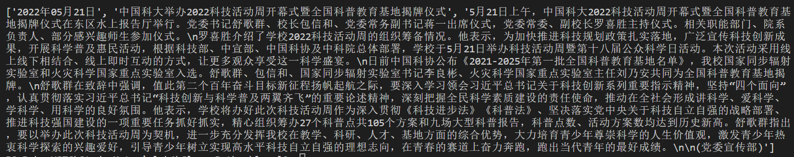

# Level 2 实验报告

PB20111686 黄瑞轩

### 选题：Level 2.13【计算机】

基于 Python，使用浏览器引擎 Selenium 爬取科大首页中的科大要闻第一条新闻，要求爬取结果至少有新闻标题、时间、以及新闻内容。

**思路**：Selenium 使用 Chrome 来做（chromedriver），通过 Selenium 的 `find_element_by_xpath` 方法找到对应的内容。

**关键代码**：

```python
browser = webdriver.Chrome()
news = []

browser.get("http://ustc.edu.cn/")
browser.find_element_by_xpath("/html/body/main/div[1]/section[1]/ul/li[1]/div[2]/h4[1]/a").click()

news.append(browser.find_element_by_xpath("/html/body/main/div/div/div[1]/form/div[1]").text)
news.append(browser.find_element_by_xpath("/html/body/main/div/div/div[1]/form/div[2]").text)
news.append(browser.find_element_by_xpath('//*[@id="vsb_content_2"]/div').text)
```

**爬取结果**：



存在 `news` 列表中，`news[0]` 为时间，`news[1]` 为标题，`news[2]` 为内容。

**用法**：

```shell
$ python3 main.py
```

> **注**：selenium 需要为特定的 Chrome 版本匹配特定的 chromedriver.exe 版本，测试时请助教前往 http://chromedriver.storage.googleapis.com/index.html 下载适合测试环境 Chrome 版本的 chromedriver.exe 并于 main.py 放置于同一目录下。


