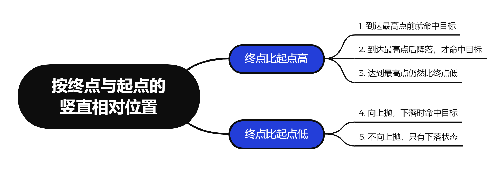

# Level 3 实验报告

PB20111686 黄瑞轩

### 选题：Level 3.6【物理】

接【数学】Level 2.3 野外彩弹 CS 游戏，考虑重力和空气阻力影响，给定发射点坐标 $(x0,y0,z0)$，落点坐标 $(x1,y1,z1)$，空气阻力 $f$（矢量，以 $(fx,fy,fz)$ 表示），及彩弹的初速度大小 $v0$（标量数值），使用 numpy、math 库等工具求解满足给定起点、落点、空气阻力和初速的发射仰角。

> 提示 1：默认 $g=9.8$ 为常数；如果初速度过小，解可能不存在
>
> 提示 2：弹道计算机的雏形

**思路**：问题的关键是是否**上抛**。从上抛到下落的过程会导致加速度变化，是这个问题的主要难点。在竖直方向，向上运动的加速度为 $g+fz/m$（向下），向下运动的加速度为 $g-fz/m$（定向向下），须知空气阻力**不是动力**。其不可能导致原本向下运动的物体向上运动，所以可以认为向下运动的物体受到的 $z$ 方向加速度仍然是向下的。



这里列出 5 种可能的情况，我们发现情况 1 和 5 是比较特殊的，情况 2 ~ 4 都是上抛再降落的情况，特判讨论即可。（详细推导过程放置在本文附录，助教可凭心情查看）

程序将采用类似二分法（这里参数设置成1.1）进行逼近，对于每一个试探解，计算出其落点位置与需求位置的相对误差 $e$，当 $e<epsilon$ 时停止迭代并输出解。

如果经过以上三种情况判断后都没有解，程序就判断没有解。

按照计算出的 $(vx,vy,vz)$ 来做时序模拟，所得结果如下所示。黄色点是初始位置，蓝色点是末了位置。

> 这里时序模拟用到了 mathplotlib 和 numpy 库。

**测试截图**：


**用法**：

```shell
$ python3 main.py
```

> **注**：这里如不做另外的修改，程序将通过 `generate` 系列函数随机生成一系列位置数据。

------

### 附录：诸情况的数学证明

**（1）到达最高点前就命中目标**

在竖直方向，有 $z1-z0=vzt-\frac12(g+fz/m)t^2$

解之，得 $t=\frac{vz-\sqrt{vz^2-2(g+fz/m)(z1-z0)}}{g+fz/m}$

此时，对于 $x,y$ 方向，约束条件：$x1-x0=vxt-\frac12(fx/m)t^2，y1-y0=vyt-\frac12(fy/m)t^2$

为了操作方便，将 $t$ 作为一个辅助函数：

```python
def t(vz, fz, z1, z0):
    return ...
```

于是约束函数为：

$L=\left[vxt-\frac12(fx/m)t^2-(x1-x0)\right]^2+\left[vyt-\frac12(fy/m)t^2-(y1-y0)\right]^2+[\sqrt{vx^2+vy^2+vz^2}-v0]^2$

这里需要捕捉的异常为：$t$ 是否是负数

**（5）不向上抛，只有下落状态**

在竖直方向，有 $z1-z0=vzt-\frac12(g-fz/m)t^2$

解之，得 $t=\frac{vz-\sqrt{vz^2-2(g-fz/m)(z1-z0)}}{g-fz/m}$

此时，对于 $x,y$ 方向，约束条件：$x1-x0=vxt-\frac12(fx/m)t^2，y1-y0=vyt-\frac12(fy/m)t^2$

于是约束函数为：

$L=\left[vxt-\frac12(fx/m)t^2-(x1-x0)\right]^2+\left[vyt-\frac12(fy/m)t^2-(y1-y0)\right]^2+[\sqrt{vx^2+vy^2+vz^2}-v0]^2$

合适的话有解，无解的情况比较复杂，不做讨论了。

**（2 ~ 4）诸情况**

上抛过程：$t1=vz/(g+fz/m)$，高度 $h=vz^2/2(g+fz/m)$

此时需要判断是否是情况（3）。

下落过程：$z0+h-z1=\frac12(g-fz/m)t2^2$，可以求出 $t2=\sqrt{2(z0-z1+h)/(g-fz/m)}$。

此时，对于 $x,y$ 方向，约束条件：$x1-x0=vxt-\frac12(fx/m)t^2，y1-y0=vyt-\frac12(fy/m)t^2$

于是约束函数为：

$L=\left[vxt-\frac12(fx/m)t^2-(x1-x0)\right]^2+\left[vyt-\frac12(fy/m)t^2-(y1-y0)\right]^2+[\sqrt{vx^2+vy^2+vz^2}-v0]^2$

这里 $t=t1+t2$，合适的话有解，无解的情况比较复杂，不做讨论了。
