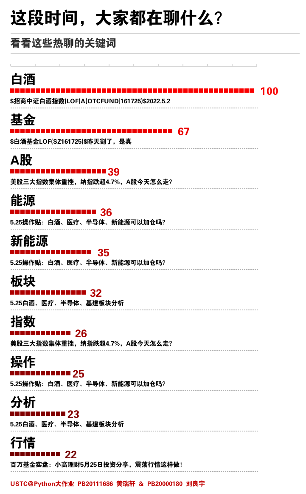

# Python 大作业实验报告

## 项目简介

**项目名称**：基金吧舆论情感走势与基金净值走势的相关检验与长线预报

**项目背景**：随着支付宝、东方财富网购买基金功能的完善，越来越多的大学生加入了炒基金的行列。和传统炒股、炒基金模式不同的是，现在购买基金的 APP 往往提供“评论区”功能，用户可以发帖、回帖、分享自己的见解。这就给我们提供了基金相关的舆论信息，有了进行情感走势与基金净值走势的相关检验及长期走势的回归预报的可能。

**项目目标**：我们小组将在各个小组成员 Level 4、5 的成果基础上，综合利用爬虫、情感分析、机器学习以及其他图形库技术，对东方财富网基金吧内舆论进行情感走势与基金净值走势的相关检验，并进行长期走势的回归预报，将成果通过图形界面展示。将基金预测结合情感分析并图形化展示是我们项目的创新点，也是重点和难点。在个人购买基金时可以使用本工具参考，具有一定的实用性。

**小组成员**：黄瑞轩（PB20111686）、刘良宇（PB20000180）、刘阳（PB20111677）；详细分工见报告最后部分。

**开发环境**：VS Code + Python 3.10.2，具体库依赖见 `requirement.txt`。

**交叉学科**：计算机 + 统计 + 金融

## 核心思路

### 爬虫部分

在进行爬虫前需要进行分析，本项目需要分析的网页有三处：

- 基金代码查询网页结构
- 基金吧（讨论区）网页结构
- 基金净值统计网页结构

#### 基金代码查询网页结构

代码查询页 url ：`http://fund.eastmoney.com/allfund.html`


我们可以从这个网页上爬取所有的基金代码和对应名称，这样即可本地实现搜索功能。


该网站进行了分块，所以需要分别识别块的 xpath 和具体基金的 xpath。

- 块的 xpath：`'/html/body/div[9]/div[2]/div/div')`
- 具体基金代码和名称 xpath：`div/a/text()` ，这里需要匹配到所有的元素

#### 基金吧网页结构

基金吧 url：`http://guba.eastmoney.com/list,of{ID}{_{Page}}.html`，其中`{ID}`表示基金代码，如果不是第一页，则需要加上`{_{Page}}`，`{Page}`表示当前页号。


基金吧内容展示是通过 request 请求可以直接获取的，所以只需要定位我们需要的数据的 xpath 信息，即可拿到原始数据。同理分析，提取我们感兴趣的数据项有：

- 最大页号 xpath：`//*[@id="articlelistnew"]/div[82]/span/span/span/span`

- 标题 xpath：`//*[@id="articlelistnew"]/div[{num}]/span[3]/a/text()`，`num `是帖子序号。

- 发帖时间 xpath：`//*[@id="articlelistnew"]/div[2]/span[5]`，这里的 2 处为帖子位置。

#### 基金净值网页结构

爬基金净值的网页 url：`https://www.dayfund.cn/fundvalue/{ID}.html`，其中`{ID}`表示基金代码。

基金净值网页内容是动态加载的，通过抓包解析可发现如下 post 内容：


只要通过 request 库发起一个 post 请求，更改不同的 `PageIndex` 即可获得不同页面。同时，对于每次请求的结果，需要定位我们感兴趣数据的 xpath 信息。我们感兴趣的数据项有：

- 日期 xpath：`//*[@id="his_nav_table"]/tbody/tr[1]/td[1]`

- 增长率 xpath：`//*[@id="his_nav_table"]/tbody/tr[1]/td[4]`

### 信息收集、统计分析和预报模块

为了代码的可维护性以及代码的易用性，小组成员分工合作。一方进行模块化的封装，并编写恰当的接口；一方根据模块编写上层逻辑。

- **数据采集和预处理模块**：

  - 数据获取：需要对获取 Http 请求的功能进行封装，同时，为了数据可持久化的需求以及便于程序各模块之间的数据交互，还需要将数据保持在 CSV 文件中。为了获取讨论区每一面的帖子，本项目实现了 `talk_bar` 类用于讨论区数据获取的封装；为了实现 CSV 文件的读写，本项目封装了 CSV 的读写类。

  - 金融用词处理：金融领域包含许多专业词汇，而且基民还创建了一些如“打板”、“抄底”、“吃面”这样的特殊词汇，基金吧中获取的评论文本具有不规范、口语化等不利于模型训练的特点，常用的分词工具并不能提供准确的分词结果，所以需要搜集网络上的金融领域名词和基民自创词汇，在送入 Transformers Pipeline 之前就进行替换，以达到对基金吧评论高准确度情感分类的目的。
  - 数据清洗：对获取到的数据需要进行数据清洗，主要有两方面。首先是基金吧里有一些非评论的帖子，比如【*好礼悬赏|新能源车vs光伏，你更看好谁？*】这种是基金公司发出来的活动帖，一般在置顶位置，需要排除；其次是一些灌水的文本，如同一用户短时间内的大量相同标题行为，所以需要在每个 CSV 组中进行查重合并。

- **情感分析模块**：Transformers 情感分析库、有道翻译 API
  - 情感分析：用 Transformers 的 `sentiment-analysis` 流水线工具可以以一个字符串为输入，得到一个表明 POSITIVE 或 NEGATIVE 的 `label` 和指示得分的 `score`。这个数据对于本项目来说非常重要。
  - 翻译：考虑到 Transformers 对英文的分析准确度较高，本项目通过向有道翻译 API 发起 request 请求的方式来获取翻译文本，提高情感分析准确度。

- **周围信息计算模块**：Matplotlib 库、Numpy 库、Jieba 库、Pyecharts 库

  - 评论区的舆论情感倾向总结（看涨、看跌的分布饼状图）
  - 评论区的舆论词云图（所用停用词表是对 github 上四个停用词表的整合）
  - 评论区的舆论情感分时变化曲线
  - 基金净值的分时变化曲线、以及预报的净值曲线

- **长线预报模块**：Transformers 库、Numpy 库
  - 需要说明的是，根据小组对现有工作的的调研及请教相关学者，使用单一经济学模型往往预测周期很长，对于短期的市场波动不能及时的反应，并且预测精度也不高，使用单一的神经网络模型就存在过拟合和模型可解释性弱的问题。因此本项目将根据更长的历史数据进行长线预测，所用模型为北京邮电大学提出的 **ARIMA-LSTM** 的组合预测模型，该模型能够充分利用基金价格中的线性部分和非线性部分，提高长线预测的准确度并减少误差。

### GUI 交互及数据流

本项目利用 PyQt5 实现了 GUI 交互，便于用户使用。具体运行截图可参见本文的运行截图部分。

本项目借鉴了软件工程中的 MVC 模式，对核心功能函数进行了抽象封装，图形界面基本只需要调用这些核心函数。


具体模块关系和数据流转图如下所示：


- 数据采集和预处理模块：`url.py`、`mycsv.py`

- 情感分析模块：`analysis.py`、`translate.py`
- 周围信息计算模块：`cloud.html`、`mplcanvas.py`、`analysis.py`
- 长线预报模块：`analysis.py`、`predict.py`
- GUI交互：`gui.py`

## 运行截图

### 爬取信息


如上展示的是输入名称查询对应基金代码功能。

### CSV 数据存储

这里展示 CSV 数据存储文件格式：

讨论区数据，包含日期，标题：


基金历史涨跌数据，包含日期，净值，净值变化：


### 情感分析综合预测

四个小分区：分别是按照基金代码和面数查询、舆论历史记录（红色表示分析为积极的，绿色表示分析为消极的）、情感得分曲线和饼状图以及词云图。


三种词云图：


并且还可根据爬取的文件进行词频分析，并生成图片格式报告，比词云图更加直观。**这里用到了 PIL 库**。



### 长线预报

如图，蓝色部分为历史记录，橙色部分为长线预报结果。


## 实现细节

这里挑选本项目有代表性的一些代码进行讲解。

### 图形界面

实现多个 Tab 的切换：

```python
class Window(QtWidgets.QTabWidget):
    def __init__(self):
        super().__init__()
        self.setWindowTitle("基金情绪分析与预测")
        self.resize(500, 600)
        self.query_page = QtWidgets.QWidget()
        self.trend_page = QtWidgets.QWidget()
        self.post_page = QtWidgets.QWidget()
        self.setup_data()
        self.setup_query_page()
        self.setup_trend_page()
        self.setup_post_page()
        self.setup_tab_widget()

    def setup_data(self):
        self.all_fund = all_fund()

    # 查询基金标签页
    def setup_query_page(self):
        ......

    # 基金趋势标签页
    def setup_trend_page(self):
        ......

    # 讨论版分析标签页
    def setup_post_page(self):
        ......

    def setup_tab_widget(self):
        ......
```

实现 Qt 展示 Matplotlib 并可以动态交互：

```python
class MplCanvas(FigureCanvasQTAgg):

    def __init__(self, parent=None, width=5, height=4, dpi=100):
        fig = Figure(figsize=(width, height), dpi=dpi)
        self.axes = fig.add_subplot(111)
        super(MplCanvas, self).__init__(fig)
        
class Window(QtWidgets.QTabWidget):
    def __init__(self):
        """......"""
    
    def setup_trend_page(self):
        """......"""
        sc = MplCanvas(self.trend_page, width=5, height=4, dpi=100)
        toolbar = NavigationToolbar(sc, self.trend_page)
        layout = QtWidgets.QVBoxLayout()
        layout.addWidget(toolbar)
        layout.addWidget(sc)
        widget = QtWidgets.QWidget(self.trend_page)
        widget.setLayout(layout)
        widget.move(0, 100)
```

### 爬虫爬取

封装与 html 文档的交互：

```python
# request获得html对象
def get_html(_url):
    return requests.get(url=_url, headers=headers)

# 获得html源文字
def get_html_text(_url):
    return requests.get(url=_url, headers=headers).text

# 获得html源文字
def get_html_text_post(_url, num:str):
    return requests.post(url=_url, headers=get_header(num)).text


# 创建xpath可读取的对象
def get_xpath_etree(_html):
    if _html[0:3] == '\r\n\r\n':
        _html = _html[4:]
    return etree.HTML(_html)


# 根据xpath获取内容
def get_content_by_xpath(_etree, _xpath):
    return _etree.xpath(_xpath)
```

针对爬取的不同网页类型封装不同的类，通过 requests 请求爬取，lazy 用于缓存：

```python
class all_fund:
    url = "http://fund.eastmoney.com/allfund.html"

    def __init__(self) -> None:
        try:
            self.lazy = get_xpath_etree(get_html_text(self.url))
        except:
            print("Error! Check network.")

    # [(code, name), ...]
    def query(self, s: str) -> list[tuple[str, str]]:
        try:
            result = []
            pages = get_content_by_xpath(self.lazy, '/html/body/div[9]/div[2]/div/div')
            for page in pages:
                funds = page.xpath('ul/li')
                for fund in funds:
                    """... 尝试获取"""
            return result
        except:
            return None
```

### 翻译与情感分析

我们针对基金价格和讨论帖分别约定了 CSV 格式，因此根据格式不同封装成类读取：

```python
class analysier:
    an = analysis.sentiment()
    tr = translate.Translate()

    def __init__(self, id: str):
        self.id = id

    def get_interested_files(self, usage: str, path='./') -> list[str]:
        """......"""

    def set_data(self) -> numpy.ndarray:
        """......"""

    def set_jz(self) -> numpy.ndarray:
        """......"""

    def set_jz_simple(self) -> numpy.ndarray:
        """......"""

    # 日期 映射到 [(标题，情感), ...]
    def trans_tk(self) -> dict[str, list[tuple[str, float]]]:
        """......"""
```

针对相应的文件，可以给出分析结果：

```python
# 日期 映射到 [(标题，情感), ...]
def trans_tk(self) -> dict[str, list[tuple[str, float]]]:
    # 先创建所有基金净值出现的天对应的字典
    # {std_date: np.array}，np.array中收录了这一天所有的舆论得分信息，positive为正，negative为负。
    filename_list: list = self.get_interested_files('rate')
    interested_dict: dict[str, list[tuple[str, float]]] = {}
    # interested_dict.get(f'{date.today()}_sa', None)
    try:
        for filename in filename_list:
            with open(filename, 'r', newline='') as f:
                reader = csv.DictReader(f)
                for row in reader:
                    _date: str = convert_date(row['date'])
                    interested_dict[_date] = []
            break # 只用最新的数据

        # 打开所有舆论文件
        filename_list: list = self.get_interested_files('talk')
        for filename in filename_list:
            with open(filename, "r", newline='') as f:
                reader = csv.DictReader(f)
                for row in reader:
                    print('------------------------------------------')
                    print(f'now processing {filename} row {row}')
                    std_date = convert_date(row['date'])
                    if std_date not in interested_dict:
                        print(f'{std_date} is not in dict!')
                        continue
                    std_talk = row['title'] # 中文
                    result = self.tr.t(std_talk)
                    print(f'success translated, sleep 0.1s')
                    label = self.an.get_label(result)
                    score = self.an.get_score(result)
                    print(f'{label}, {score}, {result}')

                    interested_dict[std_date].append(std_talk)
                    if label is True:
                        interested_dict[std_date].append((std_talk, score))
                    else:
                        interested_dict[std_date].append((std_talk, -1 * score))

        with open('./log', "w+") as f:
            f.write(interested_dict.__repr__())
        return interested_dict

    except:
        with open("./log", "w+") as f:
            f.write(interested_dict.__repr__())
        return interested_dict
```

这里针对可能出现的错误进行了 `try` - `except` 用于处理

翻译另外用到了翻译类，这里调用了有道翻译的 api：

```python
class Translate:
    def __init__(self) -> None:
        pass
	
    # api 用户信息加密
    def encrypt(self, signStr):
        hash_algorithm = hashlib.sha256()
        hash_algorithm.update(signStr.encode('utf-8'))
        return hash_algorithm.hexdigest()

	# api 签名验证
    def truncate(self, q):
        if q is None:
            return None
        size = len(q)
        return q if size <= 20 else q[0:10] + str(size) + q[size - 10:size]

	# api 请求
    def do_request(self, data):
        headers = {'Content-Type': 'application/x-www-form-urlencoded'}
        return requests.post(YOUDAO_URL, data=data, headers=headers)

	# api 翻译
    def connect(self, word):
        data = {}
        data['from'] = 'zh-CHS'
        data['to'] = 'en'
        data['signType'] = 'v3'
        curtime = str(int(time.time()))
        data['curtime'] = curtime
        salt = str(uuid.uuid1())
        signStr = APP_KEY + self.truncate(word) + salt + curtime + APP_SECRET
        sign = self.encrypt(signStr)
        data['appKey'] = APP_KEY
        data['q'] = word
        data['salt'] = salt
        data['sign'] = sign

        response = self.do_request(data)
        contentType = response.headers['Content-Type']
        ans = response.json()
        return ans["translation"][0]
```

### 趋势预报

使用了 `numpy` 等科学计算库加速，使用 `transformer` 的模型，抽象出如下接口等：

```python
def get_exp_seires(score: float):
    """..."""

def get_inner_product(score: float, array: np.ndarray, tag: bool = True) -> float:
    """..."""

def computeCost(X, y, theta):
    """..."""

def predict(score: float, array: np.ndarray, tag: bool = True) -> float:
    """..."""
```

## 项目总结与展望

过去对于我们小组成员来说，“爬虫”只是一个经常听到的概念。通过这个项目，我们亲身实践了网络爬虫，并掌握了网络爬虫的使用逻辑以及编程范式。作为一个大作业，这个项目包含了完整的 `概念 -> 流程图 -> 实际模块建立 -> 上层逻辑` 的全过程，令小组成员收获颇丰。

作为交叉学科的应用，我们从自己的生活实际出发，尝试从基金讨论区挖掘可能的对我们有用的数据。我们也了解到了现在有如 Transformers 等这样的机器学习框架可供方便的使用，扩展了我们的眼界。同时在调研的时候我们也了解到了一开始提出的 ARMA 模型的局限性，转而进行长线的宏观预测。我们认为本项目对类似基金涨跌这样长线有规律短期有较多波动的问题具有积极的探索意义。

未来如果有机会，我们将进一步优化本项目给出的趋势信息，努力使其更加直观，并考虑给出投资策略及其在相应数据集的验证。

本项目的代码统计如下，满足 `requirement.txt` 的依赖之后即可在线获取数据进行实时分析测试。

```shell
$ python3 gui.py
```

### 代码统计

```plaintext
├── analysis.py
├── color_gen.py
├── gui.py
├── mpl_canvas.py
├── mycsv.py
├── painter.py
├── predict.py
├── requirement.txt
├── stop_words.txt
├── translate.py
└── url.py
```

行数统计：

```plaintext
-------------------------------------------------------------------------------
Language                     files          blank        comment           code
-------------------------------------------------------------------------------
Python                           9            114             74            813
```

## 项目分工

**黄瑞轩（PB20111686）**完成了爬虫的分析和实现（数据采集和预处理模块）、情感分析模块（Transformers 测试、相应模块封装等）以及长线预报概念和词频分析实现。（40%）

**刘良宇（PB20000180）**完成了周围信息计算模块和 GUI 交互部分，组织模块（上层逻辑）以及长线预报的实现。（40%）

**刘阳（PB20111677）**完成了前期调研、代码的调试以及最终测试。（20%）

**实验报告撰写**：黄瑞轩、刘良宇

**实验报告审阅**：刘阳

<center>2022.06.25 @USTC 面向交叉学科的 Python 程序设计与跨学科实践 大作业报告</center>

<center>（完）</center>
