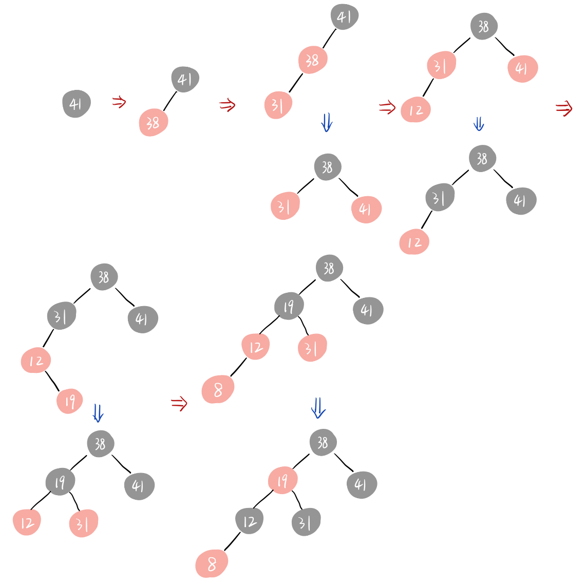
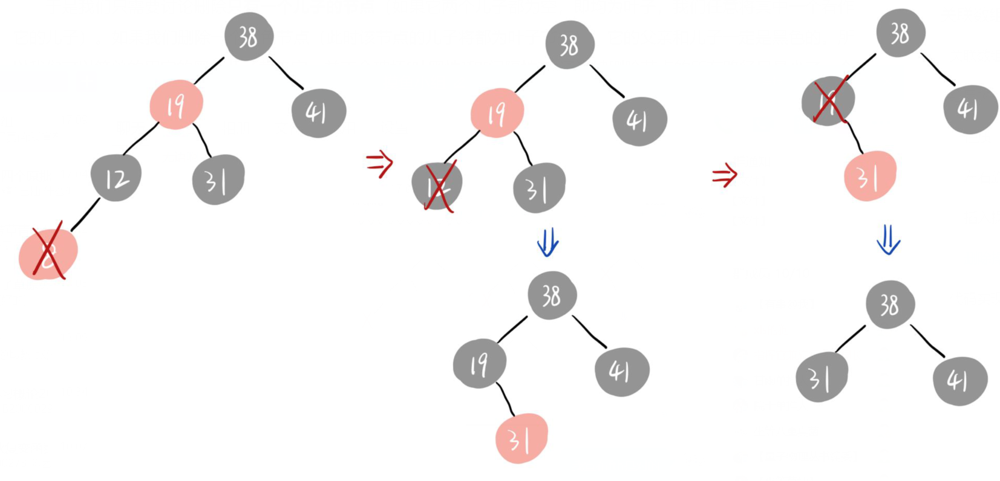

# 算法基础 HW4

PB20111686 黄瑞轩

## 1. 二叉搜索树

分两种情况讨论：

1. $x$ 是 $y$ 的左孩子。根据二叉搜索树的性质，有 $x.key<y.key$。如果存在某个结点 $z$，其关键字满足 $x.key<z.key<y.key$，则其应该在 $y$ 的左子树中，但 $y$ 的左子树只有 $x$ 这一个叶子节点，在这种情况下 $y.key$ 是 $T$ 树中大于 $x.key$ 的最小关键字。
2. $x$ 是 $y$ 的右孩子。根据二叉搜索树的性质，有 $x.key>y.key$。如果存在某个结点 $z$，其关键字满足 $x.key>z.key>y.key$，则其应该在 $y$ 的右子树中，但 $y$ 的右子树只有 $x$ 这一个叶子节点，在这种情况下 $y.key$ 是 $T$ 树中小于 $x.key$ 的最大关键字。

## 2. 红黑树

（a）红色箭头表示一步插入操作；蓝色箭头上方表示刚插入的初始状态，下方表示调整之后的状态。

（b）红色箭头表示一步删除操作；蓝色箭头上方表示刚插入的初始状态，下方表示调整之后的状态。

## 3. 区间树

（a）假设某个最大重叠点是 $p$。假设包含 $p$ 的闭区间列为 $A_1,A_2,...,A_m$，则 $\cap_{i=1}^mA_m=[q,r]$ 也包含 $p$ 并且是闭区间（当 $q=r$ 时 $[q,r]=\{q\}$），并且显然 $q,r$ 是 $A_1,A_2,...,A_m$ 中某些区间的端点。则区间 $[q,r]$ 上的每一点都是最大重叠点（因为这之中每个点与 $p$ 都不相隔区间端点），则可取 $q$ 作为满足题意的点。

（b）以红黑树为基础，扩张数据结构。

- 红黑树节点关键字是每个端点的值。

- 每个节点增加三个域。

  - $p:$ 表示此节点是左端点还是右端点，左端点 $p=+1$，右端点 $p=-1$
  - $v:$ 表示以此结点为根的子树所有节点 $p$ 域值之和
  - $m:$ 表示以此节点为根的子树的最大重叠点的重叠数

  由（a）启发，某个最大重叠点是区间端点。所以如果一个节点关键字不是最大重叠点，可以从其左右子树中分别寻找。

- INTERVAL-INSERT

  在红黑树的插入操作基础上

  - 更新插入节点 $N$ 所有祖先的 $v$ 域值
    $$
    x.v=x.left.v+x.p+x.right.v
    $$

- INTERVAL-DELETE

  在红黑树的删除操作基础上

  - 更新删除节点 $N$ 所有祖先的 $v$ 域值

- FIND-POM

  从根节点开始递归更新 $m$ 域值：
  $$
  x.m=\max\{x.left.m,\quad x.left.v+x.p,\quad x.left.v+x.p+x.right.m\}
  $$
  在更新过程中维护一个指针，指向当前更新到最新且 $m$ 最大的节点。更新结束后，此指针指向的节点关键字值就是所求。

