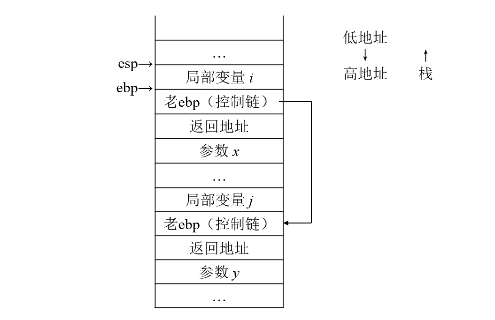

# 编译原理 H13

PB20111686

## 6.6



## 6.18

在 64 位 Windows 系统上使用 gcc version 9.2.0 (MinGW.org GCC Build-2) 编译，汇编码如下：

```assembly
	.file	"foo.cpp"
	.text
	.def	___main;	.scl	2;	.type	32;	.endef
	.section .rdata,"dr"
LC0:
	.ascii "%ld, %d\12\0"
	.text
	.globl	_main
	.def	_main;	.scl	2;	.type	32;	.endef
_main:
LFB15:
	.cfi_startproc
	pushl	%ebp
	.cfi_def_cfa_offset 8
	.cfi_offset 5, -8
	movl	%esp, %ebp
	.cfi_def_cfa_register 5
	andl	$-16, %esp
	subl	$32, %esp
	call	___main
	movl	$4, 28(%esp)	# i
	movl	$8, 24(%esp)	# j
	movl	24(%esp), %eax	# eax = j = 8(位置与j相同)
	movl	%eax, 8(%esp)	# 第三个参数，a[0][0]=eax
	movl	$0, 4(%esp)		# 第二个参数，sizeof(a)=0
	movl	$LC0, (%esp)	# 第一个参数，"%ld, %d\n"
	call	_printf
	movl	$0, %eax
	leave
	.cfi_restore 5
	.cfi_def_cfa 4, 4
	ret
	.cfi_endproc
LFE15:
	.ident	"GCC: (MinGW.org GCC Build-2) 9.2.0"
	.def	_printf;	.scl	2;	.type	32;	.endef
```

（a）`sizeof(a)` 的值为 0，这是通过数组大小计算公式得出来的。

（b）`a[0][0]` 的值是 8，从上面汇编码的注释部分可以看出，数组 a 的首地址与 j 的地址相同，所以值与 j 相同。

## 3

（1）在内存中，cp1 和 cp2 所指的位置可能是连续分布的：

```C
cp1			| cp2
1 2 3 4 5 \0  a b c d e f g h i j \0
```

执行 `strcpy` 后，cp2 比 cp1 长，因此被覆盖了：

```C
cp1			| cp2
a b c d e f   g h i j \0 f g h i j \0
```

所以输出 cp1 为 "abcdefghij"

cp2 是从原来的位置到第一个 \0 ："ghij"

（2）因为 cp2 的长度比 cp1 长，复制的时候不能保证 cp1 后面的内存可访问。如果不能访问，就会报 Segmentation Fault。

## 4

在 64 位 Windows 系统上使用 gcc version 9.2.0 (MinGW.org GCC Build-2) 编译，汇编码如下：

```assembly
	.file	"foo.c"
	.text
	.globl	_f
	.def	_f;	.scl	2;	.type	32;	.endef
_f:
LFB0:
	.cfi_startproc
	pushl	%ebp				# ebp入栈
	.cfi_def_cfa_offset 8
	.cfi_offset 5, -8
	movl	%esp, %ebp			# ebp = esp
	.cfi_def_cfa_register 5
	subl	$8, %esp			# 栈指针移动8个字节
	movl	8(%ebp), %eax		# eax = 8(%ebp)，把参数a放进eax
	movw	%ax, -4(%ebp)		# -4(%ebp) = ax（参数 short a）
	cmpw	$2, -4(%ebp)		# 把 a 与 2 比较
	jne	L2						# 不相等，执行 else 部分（L2）
	flds	12(%ebp)			# 把参数f放入浮点寄存器st0
	fnstcw	-2(%ebp)			# 把FPU状态字保存到-2(%ebp)
	movzwl	-2(%ebp), %eax		# 把FPU状态字传送到%eax，零扩展
	orb	$12, %ah				# 把 ah 和 $12 做或运算，结果保存在ah中
	movw	%ax, -6(%ebp)		# 把FPU状态字存到-6(%ebp)
	fldcw	-6(%ebp)			# 加载FPU状态字
	fistps	-8(%ebp)			# 把st0的值转换成有符号数，放到-8(%ebp)中
	fldcw	-2(%ebp)			# 加载FPU状态字
	movzwl	-8(%ebp), %eax		# 把转换过的类型的f放到eax（返回值）
	jmp	L3						# 跳转到结尾
L2:
	movzwl	-4(%ebp), %eax		# else部分，把a传送给eax（返回值）
L3:
	leave
	.cfi_restore 5
	.cfi_def_cfa 4, 4
	ret
	.cfi_endproc
LFE0:
	.ident	"GCC: (MinGW.org GCC Build-2) 9.2.0"
```

