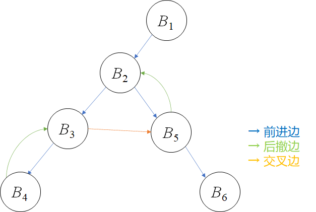

# 编译原理作业 H14

PB20111686 黄瑞轩

## 9.15

（a）$D(B_1)=\{B_1\}$，$D(B_2)=\{B_1,B_2\}$，$D(B_3)=\{B_1,B_2,B_3\}$，$D(B_4)=\{B_1,B_2,B_3,B_4\}$，$D(B_5)=\{B_1,B_2,B_5\}$，$D(B_6)=\{B_1,B_2,B_5,B_6\}$

（b）$B_1,B_2,B_3,B_5,B_6,B_4$

（c）

（d）后撤边有 $4→3,5→2$，因为 $3\ dom\ 4$、$2\ dom\ 5$，即这两条后撤边都是回边，所以此流图可归约

（e）深度为 2，因为路径 $4→3→5→2$ 有两条后撤边，图中不存在含更多后撤边的无环路径

（f）回边 $4→3$ 确定的自然循环为 $\{3,4\}$；回边 $5→2$ 确定的自然循环为 $\{2,3,4,5\}$

## 8.3

```
MOV i, R0
MOV a(R0), R1
ADD #1, R1
MOV R1, x

MOV i, R0
MOV c(R0), R1
MOV b(R1), R2
MOV R2, a(R0)

MOV i, R0
MOV j, R1
MOV b(R1), R1
MOV a(R0), R2
ADD R1, R2
MOV R2, a(R0)
```

