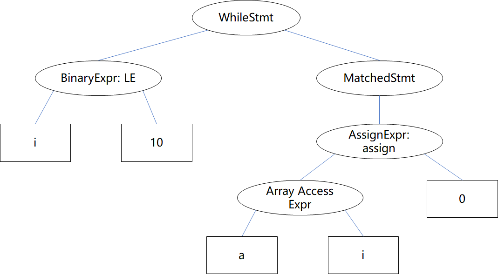

# 编译原理作业 H10-2

PB20111686 黄瑞轩

## 5.21

（a）如果 $1:c,2:c,3:c$，则表达式类型为 $c$；如果 $1:i,2:i,3:i$，则表达式类型为 $i$，不唯一。

（b）因为 $z:c$，所以 $2:c$，则 $(z*2):c$，则 $1:c$，表达式具有唯一类型 $c$。

（c）因为 $z:c$，所以 $1:c$，则 $(1*z):c$，则表达式具有唯一类型 $c$。

## 7.2

（a）



（b）

```
i 10 <= a i array 0 = while
```

（c）

```C
1  if i <= 10 goto 3
2  goto 5
3  i_1 = 4 * i
4  a[i_1] = 0
5  goto 1
6  return 0
```

