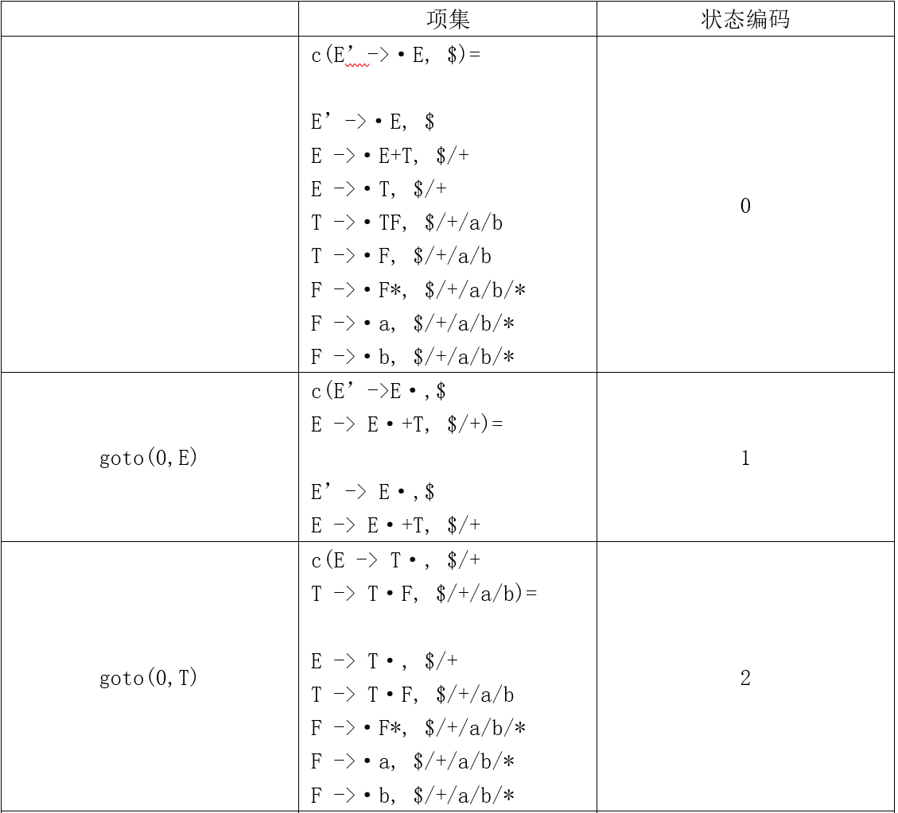

# 编译原理作业

HW6-1

PB20111686 黄瑞轩

## 3.17

将原来的文法拓广为下面的文法 $G'$：

- $S'→S$
- $S→(L)$
- $S→a$
- $L→L,S$
- $L→S$

开始状态是 $I_0=closure([S'→·S])$

$I_0=\{[S'→·S],[S→·(L)],[S→·a]\}$

$goto(I_0,S)=closure(\{[S'→S·]\})=\{[S'→S·]\}=I_1$

$goto(I_0,()=closure(\{[S→(·L)]\})=\{[S→(·L)],[L→·L,S],[L→·S],[S→·(L)],[S→·a]\}=I_2$

$goto(I_0,a)=closure(\{[S→a·]\})=\{[S→a·]\}=I_3$

$goto(I_2,L)=closure(\{[S→(L·)],[L→L·,S]\})=\{[S→(L·)],[L→L·,S]\}=I_4$

$goto(I_2,S)=closure(\{[L→S·]\})=\{[L→S·]\}=I_5$

$goto(I_2,()=closure(\{[S→(·L)]\})=I_2$

$goto(I_2,a)=closure(\{[S→a·]\})=I_3$

$goto(I_4,))=closure(\{[S→(L)·]\})=\{[S→(L)·]\}=I_6$

$goto(I_4,,)=closure(\{[L→L,·S]\})=\{[L→L,·S],[S→·(L)],[S→·a]\}=I_7$

$goto(I_7,S)=closure(\{[L→L,S·]\})=\{[L→L,S·]\}=I_8$

$goto(I_7,()=I_2$

$goto(I_7,a)=I_3$

## 3.19

（1）将原来的文法拓广为下面的文法 $G'$：

1. $E'→E$
2. $E→E+T$
3. $E→T$
4. $T→TF$
5. $T→F$
6. $F→F*$
7. $F→a$
8. $F→b$

各非终结符的 FOLLOW 集合：

| 非终结符A | FOLLOW(A) 内容 |
| :-------: | :------------: |
|    E'     |       $        |
|     E     |      +, $      |
|     T     |   a, b, +, $   |
|     F     | a, b, *, +, $  |

$G'$ 的 SLR DFA 状态转换表如下：

$G'$ 的 ACTION 表：

| ACTION |  a   |  b   |  *   |  +   |  $   |
| :----: | :--: | :--: | :--: | :--: | :--: |
|   0    |  s4  |  s5  |      |      |      |
|   1    |      |      |      |  s6  | 接受 |
|   2    |  s4  |  s5  |      |  r3  |  r3  |
|   3    |  r5  |  r5  |  s8  |  r5  |  r5  |
|   4    |  r7  |  r7  |  r7  |  r7  |  r7  |
|   5    |  r8  |  r8  |  r8  |  r8  |  r8  |
|   6    |  s4  |  s5  |      |      |      |
|   7    |  r4  |  r4  |  s8  |  r4  |  r4  |
|   8    |  r6  |  r6  |  r6  |  r6  |  r6  |
|   9    |  s4  |  s5  |      |  r2  |  r2  |

$G'$ 的 GOTO 表：

| GOTO |  E'  |  E   |  T   |  F   |
| :--: | :--: | :--: | :--: | :--: |
|  0   |      |  1   |  2   |  3   |
|  1   |      |      |      |      |
|  2   |      |      |      |  7   |
|  3   |      |      |      |      |
|  4   |      |      |      |      |
|  5   |      |      |      |      |
|  6   |      |      |  9   |  3   |
|  7   |      |      |      |      |
|  8   |      |      |      |      |
|  9   |      |      |      |  7   |

（2）首先构造 LR(1) 项目集。拓广文法 $G'$：

1. $E'→E$
2. $E→E+T$
3. $E→T$
4. $T→TF$
5. $T→F$
6. $F→F*$
7. $F→a$
8. $F→b$

各非终结符的 FIRST 集合如下：

| 非终结符A | FIRST(A) 内容 |
| :-------: | :-----------: |
|    E'     |     a, b      |
|     E     |     a, b      |
|     T     |     a, b      |
|     F     |     a, b      |

根据书上的算法构造 LR(1) 项目集

因为这个项目集不存在同心项目集，不用合并，则结果应该与SLR分析表一致：

$G'$ 的 ACTION 表：

| ACTION |  a   |  b   |  *   |  +   |  $   |
| :----: | :--: | :--: | :--: | :--: | :--: |
|   0    |  s4  |  s5  |      |      |      |
|   1    |      |      |      |  s6  | 接受 |
|   2    |  s4  |  s5  |      |  r3  |  r3  |
|   3    |  r5  |  r5  |  s8  |  r5  |  r5  |
|   4    |  r7  |  r7  |  r7  |  r7  |  r7  |
|   5    |  r8  |  r8  |  r8  |  r8  |  r8  |
|   6    |  s4  |  s5  |      |      |      |
|   7    |  r4  |  r4  |  s8  |  r4  |  r4  |
|   8    |  r6  |  r6  |  r6  |  r6  |  r6  |
|   9    |  s4  |  s5  |      |  r2  |  r2  |

$G'$ 的 GOTO 表：

| GOTO |  E'  |  E   |  T   |  F   |
| :--: | :--: | :--: | :--: | :--: |
|  0   |      |  1   |  2   |  3   |
|  1   |      |      |      |      |
|  2   |      |      |      |  7   |
|  3   |      |      |      |      |
|  4   |      |      |      |      |
|  5   |      |      |      |      |
|  6   |      |      |  9   |  3   |
|  7   |      |      |      |      |
|  8   |      |      |      |      |
|  9   |      |      |      |  7   |

