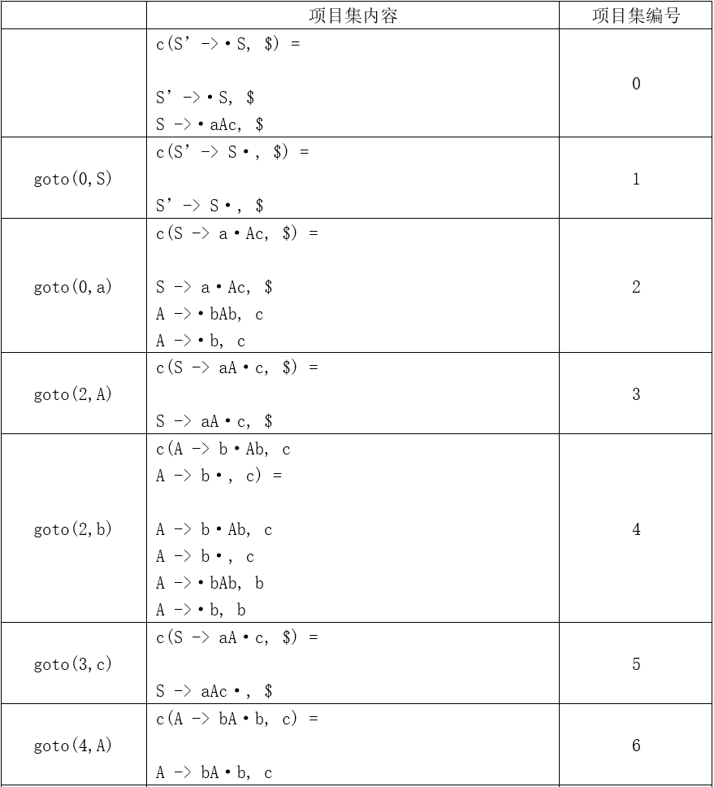
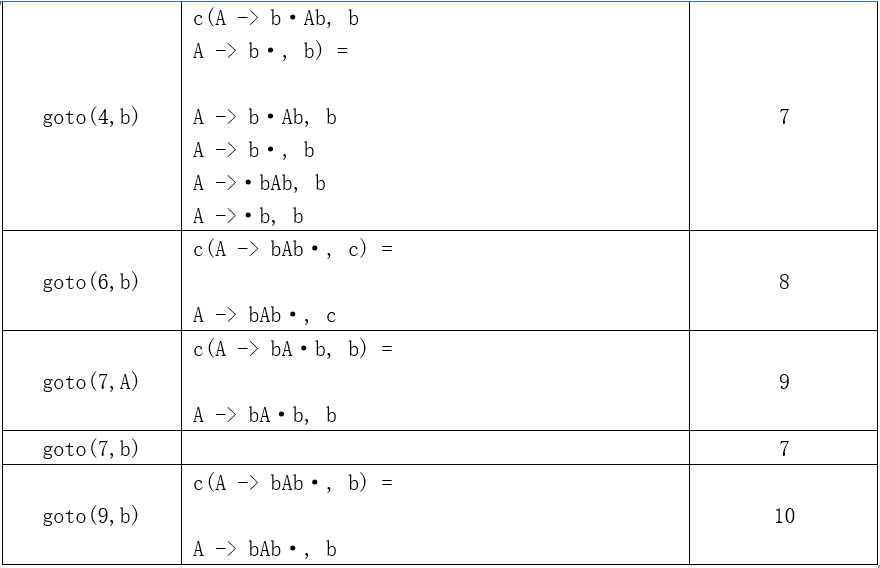

# 编译原理作业

HW6-2

PB20111686 黄瑞轩

## 3.31

文法（2）不是 LR(1) 的，因为面对两个 $b$ 中间的 $b$，没办法从向前看一个符号得出其是否是中间，不知道是移进还是规约。

将文法（2）拓广为 $G'$：

1. $S'→S$
2. $S→aAc$
3. $A→bAb$
4. $A→b$

对于状态 7，因为 $A→·b,b$ 在其中，且 goto(7,b)=7，所以 action(7,b)=s7

但是 $A→b·,b$ 也在其中，所以 action(7,b)=r4

这就出现了移进-规约冲突

## 4.3

（1）

| 拓广文法  |     语法制导定义      |
| :-------: | :-------------------: |
|  $S'→S$   |    $print(S.num)$     |
|  $S→(L)$  |    $S.num=L.num+1$    |
|   $S→a$   |       $S.num=0$       |
| $L→L_1,S$ | $L.num=L_1.num+S.num$ |
|   $L→S$   |     $L.num=S.num$     |

（2）

| 拓广文法  |               语法制导定义                |
| :-------: | :---------------------------------------: |
|  $S'→S$   |              $print(S.max)$               |
|  $S→(L)$  |              $S.max=L.max+1$              |
|   $S→a$   |                 $S.max=0$                 |
| $L→L_1,S$ | $L.max=(L_1.max>S.max)?(L_1.max):(S.max)$ |
|   $L→S$   |               $L.max=S.max$               |

